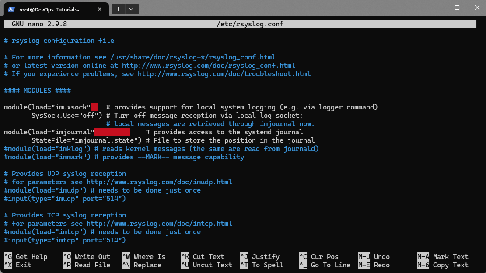
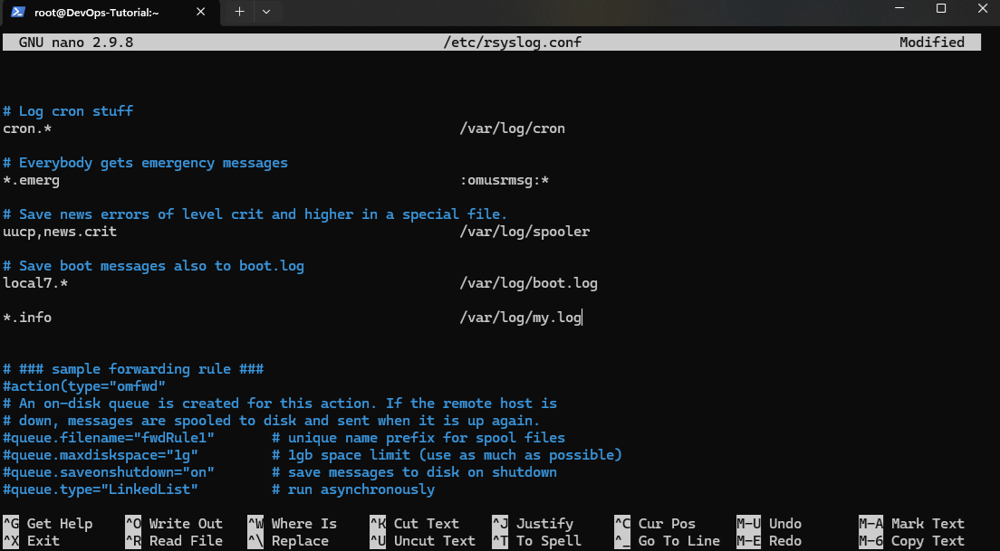

# Создать конфигурацию *syslog* для отправки сообщений уровня  *info* в файл */var/log/my.log*

Для просмотра файла, данный момент использовали команду **cat**

```bash
[root@DevOps-Tutorial ~]# cat /etc/rsyslog.conf
# rsyslog configuration file

# For more information see /usr/share/doc/rsyslog-*/rsyslog_conf.html
# or latest version online at http://www.rsyslog.com/doc/rsyslog_conf.html
# If you experience problems, see http://www.rsyslog.com/doc/troubleshoot.html

#### MODULES ####

module(load="imuxsock"    # provides support for local system logging (e.g. via logger command)
       SysSock.Use="off") # Turn off message reception via local log socket;
                          # local messages are retrieved through imjournal now.
module(load="imjournal"             # provides access to the systemd journal
       StateFile="imjournal.state") # File to store the position in the journal
#module(load="imklog") # reads kernel messages (the same are read from journald)
#module(load="immark") # provides --MARK-- message capability

# Provides UDP syslog reception
# for parameters see http://www.rsyslog.com/doc/imudp.html
#module(load="imudp") # needs to be done just once
#input(type="imudp" port="514")

# Provides TCP syslog reception
# for parameters see http://www.rsyslog.com/doc/imtcp.html
#module(load="imtcp") # needs to be done just once
#input(type="imtcp" port="514")

#### GLOBAL DIRECTIVES ####

# Where to place auxiliary files
global(workDirectory="/var/lib/rsyslog")

# Use default timestamp format
module(load="builtin:omfile" Template="RSYSLOG_TraditionalFileFormat")

# Include all config files in /etc/rsyslog.d/
include(file="/etc/rsyslog.d/*.conf" mode="optional")

#### RULES ####

# Log all kernel messages to the console.
# Logging much else clutters up the screen.
#kern.*                                                 /dev/console

# Log anything (except mail) of level info or higher.
# Don't log private authentication messages!
*.info;mail.none;authpriv.none;cron.none                /var/log/messages

# The authpriv file has restricted access.
authpriv.*                                              /var/log/secure

# Log all the mail messages in one place.
mail.*                                                  -/var/log/maillog


# Log cron stuff
cron.*                                                  /var/log/cron

# Everybody gets emergency messages
*.emerg                                                 :omusrmsg:*

# Save news errors of level crit and higher in a special file.
uucp,news.crit                                          /var/log/spooler

# Save boot messages also to boot.log
local7.*                                                /var/log/boot.log


# ### sample forwarding rule ###
#action(type="omfwd"
# An on-disk queue is created for this action. If the remote host is
# down, messages are spooled to disk and sent when it is up again.
#queue.filename="fwdRule1"       # unique name prefix for spool files
#queue.maxdiskspace="1g"         # 1gb space limit (use as much as possible)
#queue.saveonshutdown="on"       # save messages to disk on shutdown
#queue.type="LinkedList"         # run asynchronously
#action.resumeRetryCount="-1"    # infinite retries if host is down
# Remote Logging (we use TCP for reliable delivery)
# remote_host is: name/ip, e.g. 192.168.0.1, port optional e.g. 10514
#Target="remote_host" Port="XXX" Protocol="tcp")
[root@DevOps-Tutorial ~]#
```

Для редактирование  файл восвользовался команду **nano**
**Примечание:** при редакактирование файла *rsyslog.conf* нужен права root, иначе не даст нам редактировать файл

```bash
[root@DevOps-Tutorial ~]# nano /etc/rsyslog.conf
```

На скриншорте видно как выглядит редактор текста *nano*


настроить службу журналирования добавили уровня сообщения **info** в файл **/var/log/my.log** и сохраняем.



С помощью команды **cat /etc/rsyslog.conf** проверяем сохранился те данны которы мы добавили.

```bash
# Log cron stuff
cron.*                                                  /var/log/cron

# Everybody gets emergency messages
*.emerg                                                 :omusrmsg:*

# Save news errors of level crit and higher in a special file.
uucp,news.crit                                          /var/log/spooler

# Save boot messages also to boot.log
local7.*                                                /var/log/boot.log

*.info                                                  /var/log/my.log


# ### sample forwarding rule ###
#action(type="omfwd"
# An on-disk queue is created for this action. If the remote host is
# down, messages are spooled to disk and sent when it is up again.
#queue.filename="fwdRule1"       # unique name prefix for spool files
#queue.maxdiskspace="1g"         # 1gb space limit (use as much as possible)
#queue.saveonshutdown="on"       # save messages to disk on shutdown
#queue.type="LinkedList"         # run asynchronously
#action.resumeRetryCount="-1"    # infinite retries if host is down
# Remote Logging (we use TCP for reliable delivery)
# remote_host is: name/ip, e.g. 192.168.0.1, port optional e.g. 10514
#Target="remote_host" Port="XXX" Protocol="tcp")
[root@DevOps-Tutorial ~]# clear
[root@DevOps-Tutorial ~]# cat /etc/rsyslog.conf
# rsyslog configuration file

# For more information see /usr/share/doc/rsyslog-*/rsyslog_conf.html
# or latest version online at http://www.rsyslog.com/doc/rsyslog_conf.html
# If you experience problems, see http://www.rsyslog.com/doc/troubleshoot.html

#### MODULES ####

module(load="imuxsock"    # provides support for local system logging (e.g. via logger command)
       SysSock.Use="off") # Turn off message reception via local log socket;
                          # local messages are retrieved through imjournal now.
module(load="imjournal"             # provides access to the systemd journal
       StateFile="imjournal.state") # File to store the position in the journal
#module(load="imklog") # reads kernel messages (the same are read from journald)
#module(load="immark") # provides --MARK-- message capability

# Provides UDP syslog reception
# for parameters see http://www.rsyslog.com/doc/imudp.html
#module(load="imudp") # needs to be done just once
#input(type="imudp" port="514")

# Provides TCP syslog reception
# for parameters see http://www.rsyslog.com/doc/imtcp.html
#module(load="imtcp") # needs to be done just once
#input(type="imtcp" port="514")

#### GLOBAL DIRECTIVES ####

# Where to place auxiliary files
global(workDirectory="/var/lib/rsyslog")

# Use default timestamp format
module(load="builtin:omfile" Template="RSYSLOG_TraditionalFileFormat")

# Include all config files in /etc/rsyslog.d/
include(file="/etc/rsyslog.d/*.conf" mode="optional")

#### RULES ####

# Log all kernel messages to the console.
# Logging much else clutters up the screen.
#kern.*                                                 /dev/console

# Log anything (except mail) of level info or higher.
# Don't log private authentication messages!
*.info;mail.none;authpriv.none;cron.none                /var/log/messages

# The authpriv file has restricted access.
authpriv.*                                              /var/log/secure

# Log all the mail messages in one place.
mail.*                                                  -/var/log/maillog


# Log cron stuff
cron.*                                                  /var/log/cron

# Everybody gets emergency messages
*.emerg                                                 :omusrmsg:*

# Save news errors of level crit and higher in a special file.
uucp,news.crit                                          /var/log/spooler

# Save boot messages also to boot.log
local7.*                                                /var/log/boot.log

*.info                                                  /var/log/my.log


# ### sample forwarding rule ###
#action(type="omfwd"
# An on-disk queue is created for this action. If the remote host is
# down, messages are spooled to disk and sent when it is up again.
#queue.filename="fwdRule1"       # unique name prefix for spool files
#queue.maxdiskspace="1g"         # 1gb space limit (use as much as possible)
#queue.saveonshutdown="on"       # save messages to disk on shutdown
#queue.type="LinkedList"         # run asynchronously
#action.resumeRetryCount="-1"    # infinite retries if host is down
# Remote Logging (we use TCP for reliable delivery)
# remote_host is: name/ip, e.g. 192.168.0.1, port optional e.g. 10514
#Target="remote_host" Port="XXX" Protocol="tcp")
[root@DevOps-Tutorial ~]#
```

Теперь нужно перезапустить **rsyslog** Есть 2 варианта *reboot* и **systemctl restart**
Нет смысла перезугражать весь систему, так что 2  вариант

```bash
[root@DevOps-Tutorial ~]# sudo systemctl restart rsyslog
[root@DevOps-Tutorial ~]#
```

Проверяем при помощи **cat**

```bash
[root@DevOps-Tutorial ~]# cat /var/log/my.log
Dec  3 13:59:46 DevOps-Tutorial kernel: Command line: BOOT_IMAGE=(hd0,gpt2)/boot/vmlinuz-5.4.17-2136.310.7.1.el8uek.x86_64 root=UUID=a8d18b4e-1ac0-45e3-ba22-6e3a05840f20 ro console=tty0 console=ttyS0,115200n8 rootflags=discard ipv6.disable=1
Dec  3 13:59:46 DevOps-Tutorial kernel: x86/fpu: Supporting XSAVE feature 0x001: 'x87 floating point registers'
Dec  3 13:59:46 DevOps-Tutorial kernel: x86/fpu: Supporting XSAVE feature 0x002: 'SSE registers'
Dec  3 13:59:46 DevOps-Tutorial kernel: x86/fpu: Supporting XSAVE feature 0x004: 'AVX registers'
Dec  3 13:59:46 DevOps-Tutorial kernel: x86/fpu: Supporting XSAVE feature 0x020: 'AVX-512 opmask'
Dec  3 13:59:46 DevOps-Tutorial kernel: x86/fpu: Supporting XSAVE feature 0x040: 'AVX-512 Hi256'
Dec  3 13:59:46 DevOps-Tutorial kernel: x86/fpu: Supporting XSAVE feature 0x080: 'AVX-512 ZMM_Hi256'
Dec  3 13:59:46 DevOps-Tutorial kernel: x86/fpu: xstate_offset[2]:  576, xstate_sizes[2]:  256
Dec  3 13:59:46 DevOps-Tutorial kernel: x86/fpu: xstate_offset[5]: 1088, xstate_sizes[5]:   64
Dec  3 13:59:46 DevOps-Tutorial kernel: x86/fpu: xstate_offset[6]: 1152, xstate_sizes[6]:  512
Dec  3 13:59:46 DevOps-Tutorial kernel: x86/fpu: xstate_offset[7]: 1664, xstate_sizes[7]: 1024
Dec  3 13:59:46 DevOps-Tutorial kernel: x86/fpu: Enabled xstate features 0xe7, context size is 2688 bytes, using 'standard' format.
Dec  3 13:59:46 DevOps-Tutorial kernel: BIOS-provided physical RAM map:
Dec  3 13:59:46 DevOps-Tutorial kernel: BIOS-e820: [mem 0x0000000000000000-0x000000000009ffff] usable
Dec  3 13:59:46 DevOps-Tutorial kernel: BIOS-e820: [mem 0x0000000000100000-0x0000000058f4ffff] usable
Dec  3 13:59:46 DevOps-Tutorial kernel: BIOS-e820: [mem 0x0000000058f50000-0x000000005c8bbfff] reserved
Dec  3 13:59:46 DevOps-Tutorial kernel: BIOS-e820: [mem 0x000000005c8bc000-0x000000007c739fff] usable
Dec  3 13:59:46 DevOps-Tutorial kernel: BIOS-e820: [mem 0x000000007c73a000-0x000000007e521fff] reserved
Dec  3 13:59:46 DevOps-Tutorial kernel: BIOS-e820: [mem 0x000000007e522000-0x000000007e9a0fff] usable
Dec  3 13:59:46 DevOps-Tutorial kernel: BIOS-e820: [mem 0x000000007e9a1000-0x000000007e9a2fff] reserved
Dec  3 13:59:46 DevOps-Tutorial kernel: BIOS-e820: [mem 0x000000007e9a3000-0x000000007ea73fff] usable
Dec  3 13:59:46 DevOps-Tutorial kernel: BIOS-e820: [mem 0x000000007ea74000-0x000000007ea75fff] reserved
Dec  3 13:59:46 DevOps-Tutorial kernel: BIOS-e820: [mem 0x000000007ea76000-0x000000007ea8efff] usable
Dec  3 13:59:46 DevOps-Tutorial kernel: BIOS-e820: [mem 0x000000007ea8f000-0x000000007ea90fff] ACPI data
Dec  3 13:59:46 DevOps-Tutorial kernel: BIOS-e820: [mem 0x000000007ea91000-0x000000007eb1afff] reserved
Dec  3 13:59:46 DevOps-Tutorial kernel: BIOS-e820: [mem 0x000000007eb1b000-0x000000007fb9afff] usable
Dec  3 13:59:46 DevOps-Tutorial kernel: BIOS-e820: [mem 0x000000007fb9b000-0x000000007fbf2fff] reserved
Dec  3 13:59:46 DevOps-Tutorial kernel: BIOS-e820: [mem 0x000000007fbf3000-0x000000007fbfafff] ACPI data
Dec  3 13:59:46 DevOps-Tutorial kernel: BIOS-e820: [mem 0x000000007fbfb000-0x000000007fbfefff] ACPI NVS
Dec  3 13:59:46 DevOps-Tutorial kernel: BIOS-e820: [mem 0x000000007fbff000-0x000000007ff7bfff] usable
Dec  3 13:59:46 DevOps-Tutorial kernel: BIOS-e820: [mem 0x000000007ff7c000-0x000000007fffffff] reserved
Dec  3 13:59:46 DevOps-Tutorial kernel: NX (Execute Disable) protection: active
Dec  3 13:59:46 DevOps-Tutorial kernel: efi: EFI v2.70 by BHYVE
Dec  3 13:59:46 DevOps-Tutorial kernel: efi:  SMBIOS=0x7fbcc000  ACPI=0x7fbfa000  ACPI 2.0=0x7fbfa014  MEMATTR=0x7f228218
Dec  3 13:59:46 DevOps-Tutorial kernel: SMBIOS 2.8 present.
Dec  3 13:59:46 DevOps-Tutorial kernel: DMI: vStack SmartDC vStack bhyve/BHYVE, BIOS 13.0 11/10/2020
Dec  3 13:59:46 DevOps-Tutorial kernel: tsc: Detected 3000.000 MHz processor
Dec  3 13:59:46 DevOps-Tutorial kernel: tsc: Detected 2992.853 MHz TSC
Dec  3 13:59:46 DevOps-Tutorial kernel: last_pfn = 0x7ff7c max_arch_pfn = 0x400000000
Dec  3 13:59:46 DevOps-Tutorial kernel: x86/PAT: Configuration [0-7]: WB  WC  UC- UC  WB  WP  UC- WT
Dec  3 13:59:46 DevOps-Tutorial kernel: found SMP MP-table at [mem 0x000f0000-0x000f000f]
Dec  3 13:59:46 DevOps-Tutorial kernel: check: Scanning 1 areas for low memory corruption
Dec  3 13:59:46 DevOps-Tutorial kernel: Using GB pages for direct mapping
Dec  3 13:59:46 DevOps-Tutorial kernel: Secure boot disabled
Dec  3 13:59:46 DevOps-Tutorial kernel: RAMDISK: [mem 0x7c73a000-0x7e521fff]
Dec  3 13:59:46 DevOps-Tutorial kernel: Allocated new RAMDISK: [mem 0x7a1d6000-0x7bfbd247]
Dec  3 13:59:46 DevOps-Tutorial kernel: Move RAMDISK from [mem 0x7c73a000-0x7e521247] to [mem 0x7a1d6000-0x7bfbd247]
Dec  3 13:59:46 DevOps-Tutorial kernel: ACPI: Early table checksum verification disabled
Dec  3 13:59:46 DevOps-Tutorial kernel: ACPI: RSDP 0x000000007FBFA014 000024 (v02 BHYVE )
Dec  3 13:59:46 DevOps-Tutorial kernel: ACPI: XSDT 0x000000007FBF90E8 000054 (v01 BHYVE  BVFACP   00000001      01000013)
Dec  3 13:59:46 DevOps-Tutorial kernel: ACPI: FACP 0x000000007FBF8000 0000F4 (v04 BHYVE  BVFACP   00000001 BHYV 00000001)
Dec  3 13:59:46 DevOps-Tutorial kernel: ACPI: DSDT 0x000000007EA8F000 00191A (v02 BHYVE  BVDSDT   00000001 INTL 20201113)
Dec  3 13:59:46 DevOps-Tutorial kernel: ACPI: FACS 0x000000007FBFE000 000040
Dec  3 13:59:46 DevOps-Tutorial kernel: ACPI: HPET 0x000000007FBF7000 000038 (v01 BHYVE  BVHPET   00000001 BHYV 00000001)
Dec  3 13:59:46 DevOps-Tutorial kernel: ACPI: APIC 0x000000007FBF6000 00004A (v01 BHYVE  BVMADT   00000001 BHYV 00000001)
Dec  3 13:59:46 DevOps-Tutorial kernel: ACPI: MCFG 0x000000007FBF5000 00003C (v01 BHYVE  BVMCFG   00000001 BHYV 00000001)
Dec  3 13:59:46 DevOps-Tutorial kernel: ACPI: SPCR 0x000000007FBF4000 000050 (v02 BHYVE  BVSPCR   00000001 BHYV 00000001)
Dec  3 13:59:46 DevOps-Tutorial kernel: ACPI: BGRT 0x000000007FBF3000 000038 (v01 INTEL  EDK2     00000002      01000013)
Dec  3 13:59:46 DevOps-Tutorial kernel: ACPI: Reserving FACP table memory at [mem 0x7fbf8000-0x7fbf80f3]
Dec  3 13:59:46 DevOps-Tutorial kernel: ACPI: Reserving DSDT table memory at [mem 0x7ea8f000-0x7ea90919]
Dec  3 13:59:46 DevOps-Tutorial kernel: ACPI: Reserving FACS table memory at [mem 0x7fbfe000-0x7fbfe03f]
Dec  3 13:59:46 DevOps-Tutorial kernel: ACPI: Reserving HPET table memory at [mem 0x7fbf7000-0x7fbf7037]
Dec  3 13:59:46 DevOps-Tutorial kernel: ACPI: Reserving APIC table memory at [mem 0x7fbf6000-0x7fbf6049]
Dec  3 13:59:46 DevOps-Tutorial kernel: ACPI: Reserving MCFG table memory at [mem 0x7fbf5000-0x7fbf503b]
Dec  3 13:59:46 DevOps-Tutorial kernel: ACPI: Reserving SPCR table memory at [mem 0x7fbf4000-0x7fbf404f]
Dec  3 13:59:46 DevOps-Tutorial kernel: ACPI: Reserving BGRT table memory at [mem 0x7fbf3000-0x7fbf3037]
Dec  3 13:59:46 DevOps-Tutorial kernel: Setting APIC routing to physical flat.
Dec  3 13:59:46 DevOps-Tutorial kernel: No NUMA configuration found
Dec  3 13:59:46 DevOps-Tutorial kernel: Faking a node at [mem 0x0000000000000000-0x000000007ff7bfff]
Dec  3 13:59:46 DevOps-Tutorial kernel: NODE_DATA(0) allocated [mem 0x7ff0f000-0x7ff39fff]
Dec  3 13:59:46 DevOps-Tutorial kernel: Zone ranges:
Dec  3 13:59:46 DevOps-Tutorial kernel:  DMA      [mem 0x0000000000001000-0x0000000000ffffff]
Dec  3 13:59:46 DevOps-Tutorial kernel:  DMA32    [mem 0x0000000001000000-0x000000007ff7bfff]
Dec  3 13:59:46 DevOps-Tutorial kernel:  Normal   empty
Dec  3 13:59:46 DevOps-Tutorial kernel:  Device   empty
Dec  3 13:59:46 DevOps-Tutorial kernel: Movable zone start for each node
Dec  3 13:59:46 DevOps-Tutorial kernel: Early memory node ranges
Dec  3 13:59:46 DevOps-Tutorial kernel:  node   0: [mem 0x0000000000001000-0x000000000009ffff]
Dec  3 13:59:46 DevOps-Tutorial kernel:  node   0: [mem 0x0000000000100000-0x0000000058f4ffff]
Dec  3 13:59:46 DevOps-Tutorial kernel:  node   0: [mem 0x000000005c8bc000-0x000000007c739fff]
Dec  3 13:59:46 DevOps-Tutorial kernel:  node   0: [mem 0x000000007e522000-0x000000007e9a0fff]
Dec  3 13:59:46 DevOps-Tutorial kernel:  node   0: [mem 0x000000007e9a3000-0x000000007ea73fff]
Dec  3 13:59:46 DevOps-Tutorial kernel:  node   0: [mem 0x000000007ea76000-0x000000007ea8efff]
Dec  3 13:59:46 DevOps-Tutorial kernel:  node   0: [mem 0x000000007eb1b000-0x000000007fb9afff]
Dec  3 13:59:46 DevOps-Tutorial kernel:  node   0: [mem 0x000000007fbff000-0x000000007ff7bfff]
Dec  3 13:59:46 DevOps-Tutorial kernel: Zeroed struct page in unavailable ranges: 22829 pages
Dec  3 13:59:46 DevOps-Tutorial kernel: Initmem setup node 0 [mem 0x0000000000001000-0x000000007ff7bfff]
Dec  3 13:59:46 DevOps-Tutorial kernel: ACPI: PM-Timer IO Port: 0x408
Dec  3 13:59:46 DevOps-Tutorial kernel: IOAPIC[0]: apic_id 1, version 17, address 0xfec00000, GSI 0-31
Dec  3 13:59:46 DevOps-Tutorial kernel: ACPI: INT_SRC_OVR (bus 0 bus_irq 0 global_irq 2 dfl dfl)
Dec  3 13:59:46 DevOps-Tutorial kernel: Using ACPI (MADT) for SMP configuration information
Dec  3 13:59:46 DevOps-Tutorial kernel: ACPI: HPET id: 0xa400 base: 0xfed00000
Dec  3 13:59:46 DevOps-Tutorial kernel: ACPI: SPCR: console: uart,io,0x3f8,115200
Dec  3 13:59:46 DevOps-Tutorial kernel: smpboot: Allowing 1 CPUs, 0 hotplug CPUs
Dec  3 13:59:46 DevOps-Tutorial kernel: PM: Registered nosave memory: [mem 0x00000000-0x00000fff]
Dec  3 13:59:46 DevOps-Tutorial kernel: PM: Registered nosave memory: [mem 0x000a0000-0x000fffff]
Dec  3 13:59:46 DevOps-Tutorial kernel: PM: Registered nosave memory: [mem 0x58f50000-0x5c8bbfff]
Dec  3 13:59:46 DevOps-Tutorial kernel: PM: Registered nosave memory: [mem 0x7c73a000-0x7e521fff]
Dec  3 13:59:46 DevOps-Tutorial kernel: PM: Registered nosave memory: [mem 0x7e9a1000-0x7e9a2fff]
Dec  3 13:59:46 DevOps-Tutorial kernel: PM: Registered nosave memory: [mem 0x7ea74000-0x7ea75fff]
Dec  3 13:59:46 DevOps-Tutorial kernel: PM: Registered nosave memory: [mem 0x7ea8f000-0x7ea90fff]
Dec  3 13:59:46 DevOps-Tutorial kernel: PM: Registered nosave memory: [mem 0x7ea91000-0x7eb1afff]
Dec  3 13:59:46 DevOps-Tutorial kernel: PM: Registered nosave memory: [mem 0x7eb6b000-0x7eb7efff]
Dec  3 13:59:46 DevOps-Tutorial kernel: PM: Registered nosave memory: [mem 0x7fb9b000-0x7fbf2fff]
Dec  3 13:59:46 DevOps-Tutorial kernel: PM: Registered nosave memory: [mem 0x7fbf3000-0x7fbfafff]
Dec  3 13:59:46 DevOps-Tutorial kernel: PM: Registered nosave memory: [mem 0x7fbfb000-0x7fbfefff]
Dec  3 13:59:46 DevOps-Tutorial kernel: [mem 0x80000000-0xffffffff] available for PCI devices
Dec  3 13:59:46 DevOps-Tutorial kernel: Booting paravirtualized kernel on bare hardware
Dec  3 13:59:46 DevOps-Tutorial kernel: clocksource: refined-jiffies: mask: 0xffffffff max_cycles: 0xffffffff, max_idle_ns: 1910969940391419 ns
Dec  3 13:59:46 DevOps-Tutorial kernel: setup_percpu: NR_CPUS:8192 nr_cpumask_bits:1 nr_cpu_ids:1 nr_node_ids:1
Dec  3 13:59:46 DevOps-Tutorial kernel: percpu: Embedded 60 pages/cpu s208896 r8192 d28672 u2097152
Dec  3 13:59:46 DevOps-Tutorial kernel: Built 1 zonelists, mobility grouping on.  Total pages: 491230
Dec  3 13:59:46 DevOps-Tutorial kernel: Policy zone: DMA32
Dec  3 13:59:46 DevOps-Tutorial kernel: Kernel command line: BOOT_IMAGE=(hd0,gpt2)/boot/vmlinuz-5.4.17-2136.310.7.1.el8uek.x86_64 root=UUID=a8d18b4e-1ac0-45e3-ba22-6e3a05840f20 ro console=tty0 console=ttyS0,115200n8 rootflags=discard ipv6.disable=1
Dec  3 13:59:46 DevOps-Tutorial kernel: Dentry cache hash table entries: 262144 (order: 9, 2097152 bytes, linear)
Dec  3 13:59:46 DevOps-Tutorial kernel: Inode-cache hash table entries: 131072 (order: 8, 1048576 bytes, linear)
Dec  3 13:59:46 DevOps-Tutorial kernel: mem auto-init: stack:off, heap alloc:off, heap free:off
Dec  3 13:59:46 DevOps-Tutorial kernel: Memory: 249504K/2005836K available (14340K kernel code, 2244K rwdata, 10128K rodata, 3020K init, 15088K bss, 144652K reserved, 0K cma-reserved)
Dec  3 13:59:46 DevOps-Tutorial kernel: random: get_random_u64 called from __kmem_cache_create+0x33/0x47f with crng_init=0
Dec  3 13:59:46 DevOps-Tutorial kernel: SLUB: HWalign=64, Order=0-3, MinObjects=0, CPUs=1, Nodes=1
Dec  3 13:59:46 DevOps-Tutorial kernel: Kernel/User page tables isolation: enabled
Dec  3 13:59:46 DevOps-Tutorial kernel: ftrace: allocating 42147 entries in 165 pages
Dec  3 13:59:46 DevOps-Tutorial kernel: rcu: Hierarchical RCU implementation.
Dec  3 13:59:46 DevOps-Tutorial kernel: rcu: #011RCU restricting CPUs from NR_CPUS=8192 to nr_cpu_ids=1.
Dec  3 13:59:46 DevOps-Tutorial kernel: rcu: RCU calculated value of scheduler-enlistment delay is 100 jiffies.
Dec  3 13:59:46 DevOps-Tutorial kernel: rcu: Adjusting geometry for rcu_fanout_leaf=16, nr_cpu_ids=1
Dec  3 13:59:46 DevOps-Tutorial kernel: NR_IRQS: 524544, nr_irqs: 256, preallocated irqs: 16
Dec  3 13:59:46 DevOps-Tutorial kernel: Console: colour dummy device 80x25
Dec  3 13:59:46 DevOps-Tutorial kernel: printk: console [tty0] enabled
Dec  3 13:59:46 DevOps-Tutorial kernel: printk: console [ttyS0] enabled
Dec  3 13:59:46 DevOps-Tutorial kernel: ACPI: Core revision 20190816
Dec  3 13:59:46 DevOps-Tutorial kernel: clocksource: hpet: mask: 0xffffffff max_cycles: 0xffffffff, max_idle_ns: 113919999973 ns
Dec  3 13:59:46 DevOps-Tutorial kernel: APIC: Switch to symmetric I/O mode setup
Dec  3 13:59:46 DevOps-Tutorial kernel: clocksource: tsc-early: mask: 0xffffffffffffffff max_cycles: 0x2b23e604461, max_idle_ns: 440795297641 ns
Dec  3 13:59:46 DevOps-Tutorial kernel: Calibrating delay loop (skipped), value calculated using timer frequency.. 5985.70 BogoMIPS (lpj=2992853)
Dec  3 13:59:46 DevOps-Tutorial kernel: pid_max: default: 32768 minimum: 301
Dec  3 13:59:46 DevOps-Tutorial kernel: LSM: Security Framework initializing
Dec  3 13:59:46 DevOps-Tutorial kernel: Yama: becoming mindful.
Dec  3 13:59:46 DevOps-Tutorial kernel: SELinux:  Initializing.
Dec  3 13:59:46 DevOps-Tutorial kernel: Mount-cache hash table entries: 4096 (order: 3, 32768 bytes, linear)
Dec  3 13:59:46 DevOps-Tutorial kernel: Mountpoint-cache hash table entries: 4096 (order: 3, 32768 bytes, linear)
Dec  3 13:59:46 DevOps-Tutorial kernel: Last level iTLB entries: 4KB 64, 2MB 8, 4MB 8
Dec  3 13:59:46 DevOps-Tutorial kernel: Last level dTLB entries: 4KB 64, 2MB 0, 4MB 0, 1GB 4
Dec  3 13:59:46 DevOps-Tutorial kernel: FEATURE SPEC_CTRL Not Present
Dec  3 13:59:46 DevOps-Tutorial kernel: FEATURE IBPB Not Present
Dec  3 13:59:46 DevOps-Tutorial kernel: Spectre V1 : Mitigation: usercopy/swapgs barriers and __user pointer sanitization
Dec  3 13:59:46 DevOps-Tutorial kernel: Spectre V2 : Options: retpoline
Dec  3 13:59:46 DevOps-Tutorial kernel: Spectre V2 : Mitigation: Retpolines
Dec  3 13:59:46 DevOps-Tutorial kernel: Spectre V2 : Spectre v2 mitigation: Filling RSB on underflow conditions
Dec  3 13:59:46 DevOps-Tutorial kernel: Spectre V2 : Spectre v2 / SpectreRSB mitigation: Filling RSB on context switch
Dec  3 13:59:46 DevOps-Tutorial kernel: RETBleed: WARNING: Spectre v2 mitigation leaves CPU vulnerable to RETBleed attacks, data leaks possible!
Dec  3 13:59:46 DevOps-Tutorial kernel: RETBleed: Vulnerable
Dec  3 13:59:46 DevOps-Tutorial kernel: Speculative Store Bypass: Vulnerable
Dec  3 13:59:46 DevOps-Tutorial kernel: MDS: Mitigation: Clear CPU buffers
Dec  3 13:59:46 DevOps-Tutorial kernel: TAA: Mitigation: Clear CPU buffers
Dec  3 13:59:46 DevOps-Tutorial kernel: MMIO Stale Data: Vulnerable: Clear CPU buffers attempted, no microcode
Dec  3 13:59:46 DevOps-Tutorial kernel: Freeing SMP alternatives memory: 36K
Dec  3 13:59:46 DevOps-Tutorial kernel: smpboot: CPU0: Intel(R) Xeon(R) Gold 6248R CPU @ 3.00GHz (family: 0x6, model: 0x55, stepping: 0x7)
Dec  3 13:59:46 DevOps-Tutorial kernel: Performance Events: unsupported p6 CPU model 85 no PMU driver, software events only.
Dec  3 13:59:46 DevOps-Tutorial kernel: rcu: Hierarchical SRCU implementation.
Dec  3 13:59:46 DevOps-Tutorial kernel: NMI watchdog: Perf NMI watchdog permanently disabled
Dec  3 13:59:46 DevOps-Tutorial kernel: smp: Bringing up secondary CPUs ...
Dec  3 13:59:46 DevOps-Tutorial kernel: smp: Brought up 1 node, 1 CPU
Dec  3 13:59:46 DevOps-Tutorial kernel: smpboot: Max logical packages: 1
Dec  3 13:59:46 DevOps-Tutorial kernel: smpboot: Total of 1 processors activated (5985.70 BogoMIPS)
Dec  3 13:59:46 DevOps-Tutorial kernel: node 0 deferred pages initialised in 9ms
Dec  3 13:59:46 DevOps-Tutorial kernel: devtmpfs: initialized
Dec  3 13:59:46 DevOps-Tutorial kernel: x86/mm: Memory block size: 128MB
Dec  3 13:59:46 DevOps-Tutorial kernel: PM: Registering ACPI NVS region [mem 0x7fbfb000-0x7fbfefff] (16384 bytes)
Dec  3 13:59:46 DevOps-Tutorial kernel: clocksource: jiffies: mask: 0xffffffff max_cycles: 0xffffffff, max_idle_ns: 1911260446275000 ns
Dec  3 13:59:46 DevOps-Tutorial kernel: futex hash table entries: 256 (order: 2, 16384 bytes, linear)
Dec  3 13:59:46 DevOps-Tutorial kernel: pinctrl core: initialized pinctrl subsystem
Dec  3 13:59:46 DevOps-Tutorial kernel: NET: Registered protocol family 16
Dec  3 13:59:46 DevOps-Tutorial kernel: audit: initializing netlink subsys (disabled)
Dec  3 13:59:46 DevOps-Tutorial kernel: cpuidle: using governor menu
Dec  3 13:59:46 DevOps-Tutorial kernel: ACPI FADT declares the system doesn't support PCIe ASPM, so disable it
Dec  3 13:59:46 DevOps-Tutorial kernel: ACPI: bus type PCI registered
Dec  3 13:59:46 DevOps-Tutorial kernel: acpiphp: ACPI Hot Plug PCI Controller Driver version: 0.5
Dec  3 13:59:46 DevOps-Tutorial kernel: PCI: MMCONFIG for domain 0000 [bus 00-ff] at [mem 0xe0000000-0xefffffff] (base 0xe0000000)
Dec  3 13:59:46 DevOps-Tutorial kernel: audit: type=2000 audit(1733234384.025:1): state=initialized audit_enabled=0 res=1
Dec  3 13:59:46 DevOps-Tutorial kernel: PCI: not using MMCONFIG
Dec  3 13:59:46 DevOps-Tutorial kernel: PCI: Using configuration type 1 for base access
Dec  3 13:59:46 DevOps-Tutorial kernel: HugeTLB registered 1.00 GiB page size, pre-allocated 0 pages
Dec  3 13:59:46 DevOps-Tutorial kernel: HugeTLB registered 2.00 MiB page size, pre-allocated 0 pages
Dec  3 13:59:46 DevOps-Tutorial kernel: fbcon: Taking over console
Dec  3 13:59:46 DevOps-Tutorial kernel: ACPI: Added _OSI(Module Device)
Dec  3 13:59:46 DevOps-Tutorial kernel: ACPI: Added _OSI(Processor Device)
Dec  3 13:59:46 DevOps-Tutorial kernel: ACPI: Added _OSI(3.0 _SCP Extensions)
Dec  3 13:59:46 DevOps-Tutorial kernel: ACPI: Added _OSI(Processor Aggregator Device)
Dec  3 13:59:46 DevOps-Tutorial kernel: ACPI: Added _OSI(Linux-Dell-Video)
Dec  3 13:59:46 DevOps-Tutorial kernel: ACPI: Added _OSI(Linux-Lenovo-NV-HDMI-Audio)
Dec  3 13:59:46 DevOps-Tutorial kernel: ACPI: Added _OSI(Linux-HPI-Hybrid-Graphics)
Dec  3 13:59:46 DevOps-Tutorial kernel: ACPI: 1 ACPI AML tables successfully acquired and loaded
Dec  3 13:59:46 DevOps-Tutorial kernel: ACPI: Interpreter enabled
Dec  3 13:59:46 DevOps-Tutorial kernel: ACPI: (supports S0 S5)
Dec  3 13:59:46 DevOps-Tutorial kernel: ACPI: Using IOAPIC for interrupt routing
Dec  3 13:59:46 DevOps-Tutorial kernel: PCI: MMCONFIG for domain 0000 [bus 00-ff] at [mem 0xe0000000-0xefffffff] (base 0xe0000000)
Dec  3 13:59:46 DevOps-Tutorial kernel: PCI: MMCONFIG at [mem 0xe0000000-0xefffffff] reserved in ACPI motherboard resources
Dec  3 13:59:46 DevOps-Tutorial kernel: PCI: Using host bridge windows from ACPI; if necessary, use "pci=nocrs" and report a bug
Dec  3 13:59:46 DevOps-Tutorial kernel: ACPI: PCI Root Bridge [PC00] (domain 0000 [bus 00-ff])
Dec  3 13:59:46 DevOps-Tutorial kernel: acpi PNP0A03:00: _OSC: OS supports [ExtendedConfig ASPM ClockPM Segments MSI EDR HPX-Type3]
Dec  3 13:59:46 DevOps-Tutorial kernel: acpi PNP0A03:00: host bridge window expanded to [io  0x0000-0x0cf7]; [io  0x0000-0x0cf7 window] ignored
Dec  3 13:59:46 DevOps-Tutorial kernel: PCI host bridge to bus 0000:00
Dec  3 13:59:46 DevOps-Tutorial kernel: pci_bus 0000:00: root bus resource [io  0x0000-0x0cf7]
Dec  3 13:59:46 DevOps-Tutorial kernel: pci_bus 0000:00: root bus resource [io  0x0d00-0xffff window]
Dec  3 13:59:46 DevOps-Tutorial kernel: pci_bus 0000:00: root bus resource [mem 0x000a0000-0x000bffff window]
Dec  3 13:59:46 DevOps-Tutorial kernel: pci_bus 0000:00: root bus resource [mem 0xc0000000-0xdfffffff window]
Dec  3 13:59:46 DevOps-Tutorial kernel: pci_bus 0000:00: root bus resource [mem 0xf0000000-0xf07fffff window]
Dec  3 13:59:46 DevOps-Tutorial kernel: pci_bus 0000:00: root bus resource [mem 0xd000000000-0xd0000fffff window]
Dec  3 13:59:46 DevOps-Tutorial kernel: pci_bus 0000:00: root bus resource [bus 00-ff]
Dec  3 13:59:46 DevOps-Tutorial kernel: pci 0000:00:00.0: [1275:1275] type 00 class 0x060000
Dec  3 13:59:46 DevOps-Tutorial kernel: pci 0000:00:00.0: reg 0x30: [mem 0x00000000-0x000007ff pref]
Dec  3 13:59:46 DevOps-Tutorial kernel: pci 0000:00:05.0: [1af4:1000] type 00 class 0x020000
Dec  3 13:59:46 DevOps-Tutorial kernel: pci 0000:00:05.0: reg 0x10: [io  0x2080-0x20bf]
Dec  3 13:59:46 DevOps-Tutorial kernel: pci 0000:00:05.0: reg 0x14: [mem 0xc1000000-0xc1001fff]
Dec  3 13:59:46 DevOps-Tutorial kernel: pci 0000:00:05.0: reg 0x30: [mem 0x00000000-0x000007ff pref]
Dec  3 13:59:46 DevOps-Tutorial kernel: pci 0000:00:0a.0: [1af4:1001] type 00 class 0x010000
Dec  3 13:59:46 DevOps-Tutorial kernel: pci 0000:00:0a.0: reg 0x10: [io  0x2000-0x207f]
Dec  3 13:59:46 DevOps-Tutorial kernel: pci 0000:00:0a.0: reg 0x14: [mem 0xc1002000-0xc1003fff]
Dec  3 13:59:46 DevOps-Tutorial kernel: pci 0000:00:0a.0: reg 0x30: [mem 0x00000000-0x000007ff pref]
Dec  3 13:59:46 DevOps-Tutorial kernel: pci 0000:00:1b.0: [1af4:1002] type 00 class 0xff0000
Dec  3 13:59:46 DevOps-Tutorial kernel: pci 0000:00:1b.0: reg 0x10: [io  0x20c0-0x20df]
Dec  3 13:59:46 DevOps-Tutorial kernel: pci 0000:00:1b.0: reg 0x14: [mem 0xc1004000-0xc1005fff]
Dec  3 13:59:46 DevOps-Tutorial kernel: pci 0000:00:1b.0: reg 0x30: [mem 0x00000000-0x000007ff pref]
Dec  3 13:59:46 DevOps-Tutorial kernel: pci 0000:00:1c.0: [1af4:1005] type 00 class 0x100000
Dec  3 13:59:46 DevOps-Tutorial kernel: pci 0000:00:1c.0: reg 0x10: [io  0x20e0-0x20ff]
Dec  3 13:59:46 DevOps-Tutorial kernel: pci 0000:00:1c.0: reg 0x14: [mem 0xc1006000-0xc1007fff]
Dec  3 13:59:46 DevOps-Tutorial kernel: pci 0000:00:1c.0: reg 0x30: [mem 0x00000000-0x000007ff pref]
Dec  3 13:59:46 DevOps-Tutorial kernel: pci 0000:00:1d.0: [fb5d:40fb] type 00 class 0x030000
Dec  3 13:59:46 DevOps-Tutorial kernel: pci 0000:00:1d.0: reg 0x10: [mem 0xc1009000-0xc100907f]
Dec  3 13:59:46 DevOps-Tutorial kernel: pci 0000:00:1d.0: reg 0x14: [mem 0xc0000000-0xc0ffffff]
Dec  3 13:59:46 DevOps-Tutorial kernel: pci 0000:00:1d.0: reg 0x30: [mem 0x00000000-0x000007ff pref]
Dec  3 13:59:46 DevOps-Tutorial kernel: pci 0000:00:1d.0: BAR 1: assigned to efifb
Dec  3 13:59:46 DevOps-Tutorial kernel: pci 0000:00:1e.0: [8086:1e31] type 00 class 0x0c0330
Dec  3 13:59:46 DevOps-Tutorial kernel: pci 0000:00:1e.0: reg 0x10: [mem 0xc1008000-0xc1008fff]
Dec  3 13:59:46 DevOps-Tutorial kernel: pci 0000:00:1e.0: reg 0x30: [mem 0x00000000-0x000007ff pref]
Dec  3 13:59:46 DevOps-Tutorial kernel: pci 0000:00:1f.0: [8086:7000] type 00 class 0x060100
Dec  3 13:59:46 DevOps-Tutorial kernel: pci 0000:00:1f.0: reg 0x30: [mem 0x00000000-0x000007ff pref]
Dec  3 13:59:46 DevOps-Tutorial kernel: ACPI: PCI Interrupt Link [LNKA] (IRQs 3 4 5 6 *7 9 10 11 12 14 15)
Dec  3 13:59:46 DevOps-Tutorial kernel: ACPI: PCI Interrupt Link [LNKB] (IRQs 3 4 5 6 7 9 *10 11 12 14 15)
Dec  3 13:59:46 DevOps-Tutorial kernel: ACPI: PCI Interrupt Link [LNKC] (IRQs 3 4 *5 6 7 9 10 11 12 14 15)
Dec  3 13:59:46 DevOps-Tutorial kernel: ACPI: PCI Interrupt Link [LNKD] (IRQs 3 4 5 6 7 9 10 *11 12 14 15)
Dec  3 13:59:46 DevOps-Tutorial kernel: ACPI: PCI Interrupt Link [LNKE] (IRQs 3 4 5 6 7 9 10 11 12 14 15) *0, disabled.
Dec  3 13:59:46 DevOps-Tutorial kernel: ACPI: PCI Interrupt Link [LNKF] (IRQs 3 4 5 6 7 9 10 11 12 14 15) *0, disabled.
Dec  3 13:59:46 DevOps-Tutorial kernel: ACPI: PCI Interrupt Link [LNKG] (IRQs 3 4 5 6 7 9 10 11 12 14 15) *0, disabled.
Dec  3 13:59:46 DevOps-Tutorial kernel: ACPI: PCI Interrupt Link [LNKH] (IRQs 3 4 5 *6 7 9 10 11 12 14 15)
Dec  3 13:59:46 DevOps-Tutorial kernel: iommu: Default domain type: Passthrough
Dec  3 13:59:46 DevOps-Tutorial kernel: pci 0000:00:1d.0: vgaarb: setting as boot VGA device
Dec  3 13:59:46 DevOps-Tutorial kernel: pci 0000:00:1d.0: vgaarb: VGA device added: decodes=io+mem,owns=io+mem,locks=none
Dec  3 13:59:46 DevOps-Tutorial kernel: pci 0000:00:1d.0: vgaarb: bridge control possible
Dec  3 13:59:46 DevOps-Tutorial kernel: vgaarb: loaded
Dec  3 13:59:46 DevOps-Tutorial kernel: SCSI subsystem initialized
Dec  3 13:59:46 DevOps-Tutorial kernel: ACPI: bus type USB registered
Dec  3 13:59:46 DevOps-Tutorial kernel: usbcore: registered new interface driver usbfs
Dec  3 13:59:46 DevOps-Tutorial kernel: usbcore: registered new interface driver hub
Dec  3 13:59:46 DevOps-Tutorial kernel: usbcore: registered new device driver usb
Dec  3 13:59:46 DevOps-Tutorial kernel: pps_core: LinuxPPS API ver. 1 registered
Dec  3 13:59:46 DevOps-Tutorial kernel: pps_core: Software ver. 5.3.6 - Copyright 2005-2007 Rodolfo Giometti <giometti@linux.it>
Dec  3 13:59:46 DevOps-Tutorial kernel: PTP clock support registered
Dec  3 13:59:46 DevOps-Tutorial kernel: EDAC MC: Ver: 3.0.0
Dec  3 13:59:46 DevOps-Tutorial kernel: Registered efivars operations
Dec  3 13:59:46 DevOps-Tutorial kernel: PCI: Using ACPI for IRQ routing
Dec  3 13:59:46 DevOps-Tutorial kernel: NetLabel: Initializing
Dec  3 13:59:46 DevOps-Tutorial kernel: NetLabel:  domain hash size = 128
Dec  3 13:59:46 DevOps-Tutorial kernel: NetLabel:  protocols = UNLABELED CIPSOv4 CALIPSO
Dec  3 13:59:46 DevOps-Tutorial kernel: NetLabel:  unlabeled traffic allowed by default
Dec  3 13:59:46 DevOps-Tutorial kernel: hpet0: at MMIO 0xfed00000, IRQs 2, 8, 0, 0, 0, 0, 0, 0
Dec  3 13:59:46 DevOps-Tutorial kernel: hpet0: 8 comparators, 32-bit 16.777216 MHz counter
Dec  3 13:59:46 DevOps-Tutorial kernel: clocksource: Switched to clocksource tsc-early
Dec  3 13:59:46 DevOps-Tutorial kernel: VFS: Disk quotas dquot_6.6.0
Dec  3 13:59:46 DevOps-Tutorial kernel: VFS: Dquot-cache hash table entries: 512 (order 0, 4096 bytes)
Dec  3 13:59:46 DevOps-Tutorial kernel: pnp: PnP ACPI init
Dec  3 13:59:46 DevOps-Tutorial kernel: system 00:02: [io  0x0220-0x0223] has been reserved
Dec  3 13:59:46 DevOps-Tutorial kernel: system 00:02: [io  0x0224-0x0227] has been reserved
Dec  3 13:59:46 DevOps-Tutorial kernel: system 00:02: [io  0x04d0-0x04d1] has been reserved
Dec  3 13:59:46 DevOps-Tutorial kernel: system 00:02: [io  0x0400-0x0407] has been reserved
Dec  3 13:59:46 DevOps-Tutorial kernel: system 00:02: [mem 0xe0000000-0xefffffff] has been reserved
Dec  3 13:59:46 DevOps-Tutorial kernel: pnp: PnP ACPI: found 6 devices
Dec  3 13:59:46 DevOps-Tutorial kernel: thermal_sys: Registered thermal governor 'fair_share'
Dec  3 13:59:46 DevOps-Tutorial kernel: thermal_sys: Registered thermal governor 'bang_bang'
Dec  3 13:59:46 DevOps-Tutorial kernel: thermal_sys: Registered thermal governor 'step_wise'
Dec  3 13:59:46 DevOps-Tutorial kernel: thermal_sys: Registered thermal governor 'user_space'
Dec  3 13:59:46 DevOps-Tutorial kernel: clocksource: acpi_pm: mask: 0xffffff max_cycles: 0xffffff, max_idle_ns: 2085701024 ns
Dec  3 13:59:46 DevOps-Tutorial kernel: pci 0000:00:05.0: BAR 6: assigned [mem 0xc1009800-0xc1009fff pref]
Dec  3 13:59:46 DevOps-Tutorial kernel: pci 0000:00:0a.0: BAR 6: assigned [mem 0xc100a000-0xc100a7ff pref]
Dec  3 13:59:46 DevOps-Tutorial kernel: pci 0000:00:1b.0: BAR 6: assigned [mem 0xc100a800-0xc100afff pref]
Dec  3 13:59:46 DevOps-Tutorial kernel: pci 0000:00:1c.0: BAR 6: assigned [mem 0xc100b000-0xc100b7ff pref]
Dec  3 13:59:46 DevOps-Tutorial kernel: pci 0000:00:1d.0: BAR 6: assigned [mem 0xc100b800-0xc100bfff pref]
Dec  3 13:59:46 DevOps-Tutorial kernel: pci 0000:00:1e.0: BAR 6: assigned [mem 0xc100c000-0xc100c7ff pref]
Dec  3 13:59:46 DevOps-Tutorial kernel: pci 0000:00:1f.0: BAR 6: assigned [mem 0xc100c800-0xc100cfff pref]
Dec  3 13:59:46 DevOps-Tutorial kernel: pci_bus 0000:00: resource 4 [io  0x0000-0x0cf7]
Dec  3 13:59:46 DevOps-Tutorial kernel: pci_bus 0000:00: resource 5 [io  0x0d00-0xffff window]
Dec  3 13:59:46 DevOps-Tutorial kernel: pci_bus 0000:00: resource 6 [mem 0x000a0000-0x000bffff window]
Dec  3 13:59:46 DevOps-Tutorial kernel: pci_bus 0000:00: resource 7 [mem 0xc0000000-0xdfffffff window]
Dec  3 13:59:46 DevOps-Tutorial kernel: pci_bus 0000:00: resource 8 [mem 0xf0000000-0xf07fffff window]
Dec  3 13:59:46 DevOps-Tutorial kernel: pci_bus 0000:00: resource 9 [mem 0xd000000000-0xd0000fffff window]
Dec  3 13:59:46 DevOps-Tutorial kernel: NET: Registered protocol family 2
Dec  3 13:59:46 DevOps-Tutorial kernel: IP idents hash table entries: 32768 (order: 6, 262144 bytes, linear)
Dec  3 13:59:46 DevOps-Tutorial kernel: tcp_listen_portaddr_hash hash table entries: 1024 (order: 3, 32768 bytes, linear)
Dec  3 13:59:46 DevOps-Tutorial kernel: TCP established hash table entries: 16384 (order: 5, 131072 bytes, linear)
Dec  3 13:59:46 DevOps-Tutorial kernel: TCP bind hash table entries: 16384 (order: 6, 262144 bytes, linear)
Dec  3 13:59:46 DevOps-Tutorial kernel: TCP: Hash tables configured (established 16384 bind 16384)
Dec  3 13:59:46 DevOps-Tutorial kernel: UDP hash table entries: 1024 (order: 3, 32768 bytes, linear)
Dec  3 13:59:46 DevOps-Tutorial kernel: UDP-Lite hash table entries: 1024 (order: 3, 32768 bytes, linear)
Dec  3 13:59:46 DevOps-Tutorial kernel: NET: Registered protocol family 1
Dec  3 13:59:46 DevOps-Tutorial kernel: NET: Registered protocol family 44
Dec  3 13:59:46 DevOps-Tutorial kernel: pci 0000:00:1d.0: Video device with shadowed ROM at [mem 0x000c0000-0x000dffff]
Dec  3 13:59:46 DevOps-Tutorial kernel: pci 0000:00:1f.0: Activating ISA DMA hang workarounds
Dec  3 13:59:46 DevOps-Tutorial kernel: PCI: CLS 0 bytes, default 64
Dec  3 13:59:46 DevOps-Tutorial kernel: Trying to unpack rootfs image as initramfs...
Dec  3 13:59:46 DevOps-Tutorial kernel: Freeing initrd memory: 30624K
Dec  3 13:59:46 DevOps-Tutorial kernel: RAPL PMU: API unit is 2^-32 Joules, 0 fixed counters, 163840 ms ovfl timer
Dec  3 13:59:46 DevOps-Tutorial kernel: clocksource: tsc: mask: 0xffffffffffffffff max_cycles: 0x2b23e604461, max_idle_ns: 440795297641 ns
Dec  3 13:59:46 DevOps-Tutorial kernel: clocksource: Switched to clocksource tsc
Dec  3 13:59:46 DevOps-Tutorial kernel: check: Scanning for low memory corruption every 60 seconds
Dec  3 13:59:46 DevOps-Tutorial kernel: Initialise system trusted keyrings
Dec  3 13:59:46 DevOps-Tutorial kernel: Key type blacklist registered
Dec  3 13:59:46 DevOps-Tutorial kernel: workingset: timestamp_bits=36 max_order=19 bucket_order=0
Dec  3 13:59:46 DevOps-Tutorial kernel: zbud: loaded
Dec  3 13:59:46 DevOps-Tutorial kernel: Platform Keyring initialized
Dec  3 13:59:46 DevOps-Tutorial kernel: Allocating IMA blacklist keyring.
Dec  3 13:59:46 DevOps-Tutorial kernel: NET: Registered protocol family 38
Dec  3 13:59:46 DevOps-Tutorial kernel: Key type asymmetric registered
Dec  3 13:59:46 DevOps-Tutorial kernel: Asymmetric key parser 'x509' registered
Dec  3 13:59:46 DevOps-Tutorial kernel: Key type pkcs7_test registered
Dec  3 13:59:46 DevOps-Tutorial kernel: Block layer SCSI generic (bsg) driver version 0.4 loaded (major 246)
Dec  3 13:59:46 DevOps-Tutorial kernel: io scheduler mq-deadline registered
Dec  3 13:59:46 DevOps-Tutorial kernel: io scheduler kyber registered
Dec  3 13:59:46 DevOps-Tutorial kernel: io scheduler bfq registered
Dec  3 13:59:46 DevOps-Tutorial kernel: atomic64_test: passed for x86-64 platform with CX8 and with SSE
Dec  3 13:59:46 DevOps-Tutorial kernel: shpchp: Standard Hot Plug PCI Controller Driver version: 0.4
Dec  3 13:59:46 DevOps-Tutorial kernel: efifb: probing for efifb
Dec  3 13:59:46 DevOps-Tutorial kernel: efifb: framebuffer at 0xc0000000, using 1876k, total 1875k
Dec  3 13:59:46 DevOps-Tutorial kernel: efifb: mode is 800x600x32, linelength=3200, pages=1
Dec  3 13:59:46 DevOps-Tutorial kernel: efifb: scrolling: redraw
Dec  3 13:59:46 DevOps-Tutorial kernel: efifb: Truecolor: size=8:8:8:8, shift=24:16:8:0
Dec  3 13:59:46 DevOps-Tutorial kernel: Console: switching to colour frame buffer device 100x37
Dec  3 13:59:46 DevOps-Tutorial kernel: fb0: EFI VGA frame buffer device
Dec  3 13:59:46 DevOps-Tutorial kernel: input: Power Button as /devices/LNXSYSTM:00/LNXPWRBN:00/input/input0
Dec  3 13:59:46 DevOps-Tutorial kernel: ACPI: Power Button [PWRF]
Dec  3 13:59:46 DevOps-Tutorial kernel: Serial: 8250/16550 driver, 4 ports, IRQ sharing enabled
Dec  3 13:59:46 DevOps-Tutorial kernel: 00:03: ttyS0 at I/O 0x3f8 (irq = 4, base_baud = 115200) is a 16550A
Dec  3 13:59:46 DevOps-Tutorial kernel: 00:04: ttyS1 at I/O 0x2f8 (irq = 3, base_baud = 115200) is a 16550A
Dec  3 13:59:46 DevOps-Tutorial kernel: serial8250: ttyS2 at I/O 0x3e8 (irq = 4, base_baud = 115200) is a 16550A
Dec  3 13:59:46 DevOps-Tutorial kernel: serial8250: ttyS3 at I/O 0x2e8 (irq = 3, base_baud = 115200) is a 16550A
Dec  3 13:59:46 DevOps-Tutorial kernel: Non-volatile memory driver v1.3
Dec  3 13:59:46 DevOps-Tutorial kernel: Linux agpgart interface v0.103
Dec  3 13:59:46 DevOps-Tutorial kernel: AMD-Vi: AMD IOMMUv2 driver by Joerg Roedel <jroedel@suse.de>
Dec  3 13:59:46 DevOps-Tutorial kernel: AMD-Vi: AMD IOMMUv2 functionality not available on this system
Dec  3 13:59:46 DevOps-Tutorial kernel: rdac: device handler registered
Dec  3 13:59:46 DevOps-Tutorial kernel: hp_sw: device handler registered
Dec  3 13:59:46 DevOps-Tutorial kernel: emc: device handler registered
Dec  3 13:59:46 DevOps-Tutorial kernel: alua: device handler registered
Dec  3 13:59:46 DevOps-Tutorial kernel: VFIO - User Level meta-driver version: 0.3
Dec  3 13:59:46 DevOps-Tutorial kernel: ehci_hcd: USB 2.0 'Enhanced' Host Controller (EHCI) Driver
Dec  3 13:59:46 DevOps-Tutorial kernel: ehci-pci: EHCI PCI platform driver
Dec  3 13:59:46 DevOps-Tutorial kernel: ohci_hcd: USB 1.1 'Open' Host Controller (OHCI) Driver
Dec  3 13:59:46 DevOps-Tutorial kernel: ohci-pci: OHCI PCI platform driver
Dec  3 13:59:46 DevOps-Tutorial kernel: uhci_hcd: USB Universal Host Controller Interface driver
Dec  3 13:59:46 DevOps-Tutorial kernel: xhci_hcd 0000:00:1e.0: xHCI Host Controller
Dec  3 13:59:46 DevOps-Tutorial kernel: xhci_hcd 0000:00:1e.0: new USB bus registered, assigned bus number 1
Dec  3 13:59:46 DevOps-Tutorial kernel: xhci_hcd 0000:00:1e.0: hcc params 0x03401281 hci version 0x100 quirks 0x000000000000b930
Dec  3 13:59:46 DevOps-Tutorial kernel: usb usb1: New USB device found, idVendor=1d6b, idProduct=0002, bcdDevice= 5.04
Dec  3 13:59:46 DevOps-Tutorial kernel: usb usb1: New USB device strings: Mfr=3, Product=2, SerialNumber=1
Dec  3 13:59:46 DevOps-Tutorial kernel: usb usb1: Product: xHCI Host Controller
Dec  3 13:59:46 DevOps-Tutorial kernel: usb usb1: Manufacturer: Linux 5.4.17-2136.310.7.1.el8uek.x86_64 xhci-hcd
Dec  3 13:59:46 DevOps-Tutorial kernel: usb usb1: SerialNumber: 0000:00:1e.0
Dec  3 13:59:46 DevOps-Tutorial kernel: hub 1-0:1.0: USB hub found
Dec  3 13:59:46 DevOps-Tutorial kernel: hub 1-0:1.0: 4 ports detected
Dec  3 13:59:46 DevOps-Tutorial kernel: xhci_hcd 0000:00:1e.0: xHCI Host Controller
Dec  3 13:59:46 DevOps-Tutorial kernel: xhci_hcd 0000:00:1e.0: new USB bus registered, assigned bus number 2
Dec  3 13:59:46 DevOps-Tutorial kernel: xhci_hcd 0000:00:1e.0: Host supports USB 3.0 SuperSpeed
Dec  3 13:59:46 DevOps-Tutorial kernel: usb usb2: We don't know the algorithms for LPM for this host, disabling LPM.
Dec  3 13:59:46 DevOps-Tutorial kernel: usb usb2: New USB device found, idVendor=1d6b, idProduct=0003, bcdDevice= 5.04
Dec  3 13:59:46 DevOps-Tutorial kernel: usb usb2: New USB device strings: Mfr=3, Product=2, SerialNumber=1
Dec  3 13:59:46 DevOps-Tutorial kernel: usb usb2: Product: xHCI Host Controller
Dec  3 13:59:46 DevOps-Tutorial kernel: usb usb2: Manufacturer: Linux 5.4.17-2136.310.7.1.el8uek.x86_64 xhci-hcd
Dec  3 13:59:46 DevOps-Tutorial kernel: usb usb2: SerialNumber: 0000:00:1e.0
Dec  3 13:59:46 DevOps-Tutorial kernel: hub 2-0:1.0: USB hub found
Dec  3 13:59:46 DevOps-Tutorial kernel: hub 2-0:1.0: 4 ports detected
Dec  3 13:59:46 DevOps-Tutorial kernel: usbcore: registered new interface driver usbserial_generic
Dec  3 13:59:46 DevOps-Tutorial kernel: usbserial: USB Serial support registered for generic
Dec  3 13:59:46 DevOps-Tutorial kernel: i8042: PNP: PS/2 Controller [PNP0303:KBD,PNP0f03:MOU] at 0x60,0x64 irq 1,12
Dec  3 13:59:46 DevOps-Tutorial kernel: i8042: Warning: Keylock active
Dec  3 13:59:46 DevOps-Tutorial kernel: serio: i8042 KBD port at 0x60,0x64 irq 1
Dec  3 13:59:46 DevOps-Tutorial kernel: serio: i8042 AUX port at 0x60,0x64 irq 12
Dec  3 13:59:46 DevOps-Tutorial kernel: mousedev: PS/2 mouse device common for all mice
Dec  3 13:59:46 DevOps-Tutorial kernel: input: AT Translated Set 2 keyboard as /devices/platform/i8042/serio0/input/input1
Dec  3 13:59:46 DevOps-Tutorial kernel: rtc_cmos 00:05: registered as rtc0
Dec  3 13:59:46 DevOps-Tutorial kernel: rtc_cmos 00:05: alarms up to one day, y3k, 114 bytes nvram
Dec  3 13:59:46 DevOps-Tutorial kernel: intel_pstate: CPU model not supported
Dec  3 13:59:46 DevOps-Tutorial kernel: EFI Variables Facility v0.08 2004-May-17
Dec  3 13:59:46 DevOps-Tutorial kernel: hidraw: raw HID events driver (C) Jiri Kosina
Dec  3 13:59:46 DevOps-Tutorial kernel: usbcore: registered new interface driver usbhid
Dec  3 13:59:46 DevOps-Tutorial kernel: usbhid: USB HID core driver
Dec  3 13:59:46 DevOps-Tutorial kernel: drop_monitor: Initializing network drop monitor service
Dec  3 13:59:46 DevOps-Tutorial kernel: Initializing XFRM netlink socket
Dec  3 13:59:46 DevOps-Tutorial kernel: IPv6: Loaded, but administratively disabled, reboot required to enable
Dec  3 13:59:46 DevOps-Tutorial kernel: NET: Registered protocol family 17
Dec  3 13:59:46 DevOps-Tutorial kernel: bridge: filtering via arp/ip/ip6tables is no longer available by default. Update your scripts to load br_netfilter if you need this.
Dec  3 13:59:46 DevOps-Tutorial kernel: IPI shorthand broadcast: enabled
Dec  3 13:59:46 DevOps-Tutorial kernel: sched_clock: Marking stable (1396123400, 120087575)->(1558259451, -42048476)
Dec  3 13:59:46 DevOps-Tutorial kernel: registered taskstats version 1
Dec  3 13:59:46 DevOps-Tutorial kernel: Loading compiled-in X.509 certificates
Dec  3 13:59:46 DevOps-Tutorial kernel: Loaded X.509 cert 'Oracle CA Server: f75e9b5e5c58b65ea5cac4777c241c6a74f7981c'
Dec  3 13:59:46 DevOps-Tutorial kernel: Loaded X.509 cert 'Oracle Linux Kernel Module Signing Key: 2bb352412969a3653f0eb6021763408ebb9bb5ab'
Dec  3 13:59:46 DevOps-Tutorial kernel: Loaded X.509 cert 'Oracle America, Inc.: Ksplice Kernel Module Signing Key: 09010ebef5545fa7c54b626ef518e077b5b1ee4c'
Dec  3 13:59:46 DevOps-Tutorial kernel: Loaded X.509 cert 'Oracle IMA signing CA: a2f28976a05984028f7d1a4904ae14e8e468e551'
Dec  3 13:59:46 DevOps-Tutorial kernel: blacklist: Loading compiled-in revocation X.509 certificates
Dec  3 13:59:46 DevOps-Tutorial kernel: Loaded X.509 cert 'Oracle Corporation: 7f559b8e9d9e05183480a7149e5a1de0bc265ada'
Dec  3 13:59:46 DevOps-Tutorial kernel: Loaded X.509 cert 'Oracle Corporation: c179886de39a159135e9877492debf044af7d1eb'
Dec  3 13:59:46 DevOps-Tutorial kernel: Loaded X.509 cert 'Oracle Corporation: 51698ec3be0f5eb8cba8ec197d291879098fade4'
Dec  3 13:59:46 DevOps-Tutorial kernel: zswap: loaded using pool lzo/zbud
Dec  3 13:59:46 DevOps-Tutorial kernel: page_owner is disabled
Dec  3 13:59:46 DevOps-Tutorial kernel: Key type ._fscrypt registered
Dec  3 13:59:46 DevOps-Tutorial kernel: Key type .fscrypt registered
Dec  3 13:59:46 DevOps-Tutorial kernel: Key type big_key registered
Dec  3 13:59:46 DevOps-Tutorial kernel: Key type encrypted registered
Dec  3 13:59:46 DevOps-Tutorial kernel: ima: No TPM chip found, activating TPM-bypass!
Dec  3 13:59:46 DevOps-Tutorial kernel: ima: Allocated hash algorithm: sha256
Dec  3 13:59:46 DevOps-Tutorial kernel: ima: No architecture policies found
Dec  3 13:59:46 DevOps-Tutorial kernel: evm: Initialising EVM extended attributes:
Dec  3 13:59:46 DevOps-Tutorial kernel: evm: security.selinux
Dec  3 13:59:46 DevOps-Tutorial kernel: evm: security.ima
Dec  3 13:59:46 DevOps-Tutorial kernel: evm: security.capability
Dec  3 13:59:46 DevOps-Tutorial kernel: evm: HMAC attrs: 0x1
Dec  3 13:59:46 DevOps-Tutorial kernel: rtc_cmos 00:05: setting system clock to 2024-12-03T13:59:46 UTC (1733234386)
Dec  3 13:59:46 DevOps-Tutorial kernel: RAS: Correctable Errors collector initialized.
Dec  3 13:59:46 DevOps-Tutorial kernel: integrity: Unable to open file: /etc/keys/x509_ima.der (-2)
Dec  3 13:59:46 DevOps-Tutorial kernel: Freeing unused decrypted memory: 2040K
Dec  3 13:59:46 DevOps-Tutorial kernel: Freeing unused kernel image memory: 3020K
Dec  3 13:59:46 DevOps-Tutorial kernel: Write protecting the kernel read-only data: 26624k
Dec  3 13:59:46 DevOps-Tutorial kernel: Freeing unused kernel image memory: 2040K
Dec  3 13:59:46 DevOps-Tutorial kernel: Freeing unused kernel image memory: 112K
Dec  3 13:59:46 DevOps-Tutorial kernel: rodata_test: all tests were successful
Dec  3 13:59:46 DevOps-Tutorial kernel: Run /init as init process
Dec  3 13:59:46 DevOps-Tutorial systemd[1]: systemd 239 (239-58.0.1.el8_6.7) running in system mode. (+PAM +AUDIT +SELINUX +IMA -APPARMOR +SMACK +SYSVINIT +UTMP +LIBCRYPTSETUP +GCRYPT +GNUTLS +ACL +XZ +LZ4 +SECCOMP +BLKID +ELFUTILS +KMOD +IDN2 -IDN +PCRE2 default-hierarchy=legacy)
Dec  3 13:59:46 DevOps-Tutorial systemd[1]: Detected virtualization bhyve.
Dec  3 13:59:46 DevOps-Tutorial systemd[1]: Detected architecture x86-64.
Dec  3 13:59:46 DevOps-Tutorial systemd[1]: Running in initial RAM disk.
Dec  3 13:59:46 DevOps-Tutorial systemd[1]: Set hostname to <localhost.localdomain>.
Dec  3 13:59:46 DevOps-Tutorial kernel: random: systemd: uninitialized urandom read (16 bytes read)
Dec  3 13:59:46 DevOps-Tutorial systemd[1]: Reached target Swap.
Dec  3 13:59:46 DevOps-Tutorial kernel: random: systemd: uninitialized urandom read (16 bytes read)
Dec  3 13:59:46 DevOps-Tutorial systemd[1]: Listening on Journal Socket.
Dec  3 13:59:46 DevOps-Tutorial kernel: random: systemd: uninitialized urandom read (16 bytes read)
Dec  3 13:59:46 DevOps-Tutorial systemd[1]: Starting Setup Virtual Console...
Dec  3 13:59:46 DevOps-Tutorial systemd[1]: Starting Create list of required static device nodes for the current kernel...
Dec  3 13:59:46 DevOps-Tutorial systemd[1]: Listening on udev Control Socket.
Dec  3 13:59:46 DevOps-Tutorial kernel: usb 2-1: new SuperSpeed Gen 1 USB device number 2 using xhci_hcd
Dec  3 13:59:46 DevOps-Tutorial kernel: usb 2-1: New USB device found, idVendor=fb5d, idProduct=0001, bcdDevice= 0.00
Dec  3 13:59:46 DevOps-Tutorial kernel: usb 2-1: New USB device strings: Mfr=1, Product=2, SerialNumber=3
Dec  3 13:59:46 DevOps-Tutorial kernel: usb 2-1: Product: HID Tablet
Dec  3 13:59:46 DevOps-Tutorial kernel: usb 2-1: Manufacturer: BHYVE
Dec  3 13:59:46 DevOps-Tutorial kernel: usb 2-1: SerialNumber: 01
Dec  3 13:59:46 DevOps-Tutorial kernel: input: BHYVE HID Tablet as /devices/pci0000:00/0000:00:1e.0/usb2/2-1/2-1:1.0/0003:FB5D:0001.0001/input/input4
Dec  3 13:59:46 DevOps-Tutorial kernel: hid-generic 0003:FB5D:0001.0001: input,hidraw0: USB HID v10.01 Mouse [BHYVE HID Tablet] on usb-0000:00:1e.0-1/input0
Dec  3 13:59:46 DevOps-Tutorial kernel: IPMI message handler: version 39.2
Dec  3 13:59:46 DevOps-Tutorial kernel: ipmi device interface
Dec  3 13:59:46 DevOps-Tutorial kernel: random: fast init done
Dec  3 13:59:46 DevOps-Tutorial systemd-journald[150]: Journal started
Dec  3 13:59:46 DevOps-Tutorial systemd-journald[150]: Runtime journal (/run/log/journal/06088db1377a47b2bcd19b4355d5886f) is 8.0M, max 94.2M, 86.2M free.
Dec  3 13:59:46 DevOps-Tutorial systemd-modules-load[149]: Module 'msr' is builtin
Dec  3 13:59:46 DevOps-Tutorial systemd-modules-load[149]: Inserted module 'ipmi_devintf'
Dec  3 13:59:46 DevOps-Tutorial systemd-sysctl[171]: Couldn't write 'fq_codel' to 'net/core/default_qdisc', ignoring: No such file or directory
Dec  3 13:59:46 DevOps-Tutorial systemd-sysctl[171]: Couldn't write '1' to 'net/ipv6/conf/all/disable_ipv6', ignoring: No such file or directory
Dec  3 13:59:46 DevOps-Tutorial systemd[1]: systemd-vconsole-setup.service: Succeeded.
Dec  3 13:59:46 DevOps-Tutorial systemd[1]: Started Setup Virtual Console.
Dec  3 13:59:46 DevOps-Tutorial systemd[1]: Starting dracut cmdline hook...
Dec  3 13:59:46 DevOps-Tutorial dracut-cmdline[177]: dracut-8.6 dracut-049-202.git20220511.0.1.el8_6
Dec  3 13:59:46 DevOps-Tutorial dracut-cmdline[177]: Using kernel command line parameters: BOOT_IMAGE=(hd0,gpt2)/boot/vmlinuz-5.4.17-2136.310.7.1.el8uek.x86_64 root=UUID=a8d18b4e-1ac0-45e3-ba22-6e3a05840f20 ro console=tty0 console=ttyS0,115200n8 rootflags=discard ipv6.disable=1
Dec  3 13:59:46 DevOps-Tutorial systemd[1]: Started dracut cmdline hook.
Dec  3 13:59:46 DevOps-Tutorial systemd[1]: Starting dracut pre-udev hook...
Dec  3 13:59:46 DevOps-Tutorial systemd[1]: Started dracut pre-udev hook.
Dec  3 13:59:46 DevOps-Tutorial systemd[1]: Starting udev Kernel Device Manager...
Dec  3 13:59:46 DevOps-Tutorial systemd[1]: Started udev Kernel Device Manager.
Dec  3 13:59:46 DevOps-Tutorial systemd[1]: Starting udev Coldplug all Devices...
Dec  3 13:59:47 DevOps-Tutorial systemd[1]: Mounting Kernel Configuration File System...
Dec  3 13:59:47 DevOps-Tutorial systemd[1]: Mounted Kernel Configuration File System.
Dec  3 13:59:47 DevOps-Tutorial systemd[1]: Started udev Coldplug all Devices.
Dec  3 13:59:47 DevOps-Tutorial systemd[1]: Starting dracut initqueue hook...
Dec  3 13:59:47 DevOps-Tutorial systemd[1]: Starting Show Plymouth Boot Screen...
Dec  3 13:59:47 DevOps-Tutorial systemd[1]: Reached target System Initialization.
Dec  3 13:59:47 DevOps-Tutorial kernel: input: PS/2 Generic Mouse as /devices/platform/i8042/serio1/input/input3
Dec  3 13:59:47 DevOps-Tutorial kernel: virtio-pci 0000:00:05.0: virtio_pci: leaving for legacy driver
Dec  3 13:59:47 DevOps-Tutorial systemd-udevd[263]: link_config: autonegotiation is unset or enabled, the speed and duplex are not writable.
Dec  3 13:59:47 DevOps-Tutorial systemd[1]: Received SIGRTMIN+20 from PID 274 (plymouthd).
Dec  3 13:59:47 DevOps-Tutorial kernel: virtio-pci 0000:00:0a.0: virtio_pci: leaving for legacy driver
Dec  3 13:59:47 DevOps-Tutorial kernel: virtio-pci 0000:00:1b.0: virtio_pci: leaving for legacy driver
Dec  3 13:59:47 DevOps-Tutorial kernel: virtio-pci 0000:00:1c.0: virtio_pci: leaving for legacy driver
Dec  3 13:59:47 DevOps-Tutorial systemd[1]: Started Show Plymouth Boot Screen.
Dec  3 13:59:47 DevOps-Tutorial systemd[1]: Started Forward Password Requests to Plymouth Directory Watch.
Dec  3 13:59:47 DevOps-Tutorial systemd[1]: Reached target Paths.
Dec  3 13:59:47 DevOps-Tutorial systemd[1]: Reached target Basic System.
Dec  3 13:59:47 DevOps-Tutorial kernel: crng init done
Dec  3 13:59:47 DevOps-Tutorial kernel: random: 7 urandom warning(s) missed due to ratelimiting
Dec  3 13:59:47 DevOps-Tutorial kernel: virtio_blk virtio1: [vda] 52428800 512-byte logical blocks (26.8 GB/25.0 GiB)
Dec  3 13:59:47 DevOps-Tutorial kernel: vda: detected capacity change from 0 to 26843545600
Dec  3 13:59:47 DevOps-Tutorial kernel: vda: vda1 vda2
Dec  3 13:59:47 DevOps-Tutorial systemd-udevd[264]: Using default interface naming scheme 'rhel-8.0'.
Dec  3 13:59:47 DevOps-Tutorial systemd-udevd[264]: link_config: autonegotiation is unset or enabled, the speed and duplex are not writable.
Dec  3 13:59:47 DevOps-Tutorial kernel: virtio_net virtio0 enp0s5: renamed from eth0
Dec  3 13:59:47 DevOps-Tutorial systemd[1]: Found device /dev/disk/by-uuid/a8d18b4e-1ac0-45e3-ba22-6e3a05840f20.
Dec  3 13:59:47 DevOps-Tutorial systemd[1]: Reached target Initrd Root Device.
Dec  3 13:59:47 DevOps-Tutorial systemd[1]: Started dracut initqueue hook.
Dec  3 13:59:47 DevOps-Tutorial systemd[1]: Reached target Remote File Systems (Pre).
Dec  3 13:59:47 DevOps-Tutorial systemd[1]: Reached target Remote File Systems.
Dec  3 13:59:47 DevOps-Tutorial systemd[1]: Starting File System Check on /dev/disk/by-uuid/a8d18b4e-1ac0-45e3-ba22-6e3a05840f20...
Dec  3 13:59:47 DevOps-Tutorial systemd-fsck[298]: /usr/sbin/fsck.xfs: XFS file system.
Dec  3 13:59:47 DevOps-Tutorial systemd[1]: Started File System Check on /dev/disk/by-uuid/a8d18b4e-1ac0-45e3-ba22-6e3a05840f20.
Dec  3 13:59:47 DevOps-Tutorial systemd[1]: Mounting /sysroot...
Dec  3 13:59:47 DevOps-Tutorial kernel: SGI XFS with ACLs, security attributes, realtime, scrub, repair, no debug enabled
Dec  3 13:59:47 DevOps-Tutorial kernel: XFS (vda2): Mounting V5 Filesystem
Dec  3 13:59:47 DevOps-Tutorial kernel: XFS (vda2): Ending clean mount
Dec  3 13:59:47 DevOps-Tutorial systemd[1]: Mounted /sysroot.
Dec  3 13:59:47 DevOps-Tutorial systemd[1]: Reached target Initrd Root File System.
Dec  3 13:59:47 DevOps-Tutorial systemd[1]: Starting Reload Configuration from the Real Root...
Dec  3 13:59:47 DevOps-Tutorial systemd[1]: Reloading.
Dec  3 13:59:47 DevOps-Tutorial systemd[1]: initrd-parse-etc.service: Succeeded.
Dec  3 13:59:47 DevOps-Tutorial systemd[1]: Started Reload Configuration from the Real Root.
Dec  3 13:59:47 DevOps-Tutorial systemd[1]: Reached target Initrd File Systems.
Dec  3 13:59:47 DevOps-Tutorial systemd[1]: Reached target Initrd Default Target.
Dec  3 13:59:47 DevOps-Tutorial systemd[1]: Starting dracut pre-pivot and cleanup hook...
Dec  3 13:59:47 DevOps-Tutorial systemd[1]: Started dracut pre-pivot and cleanup hook.
Dec  3 13:59:47 DevOps-Tutorial systemd[1]: Starting Cleaning Up and Shutting Down Daemons...
Dec  3 13:59:48 DevOps-Tutorial systemd[1]: dracut-pre-pivot.service: Succeeded.
Dec  3 13:59:48 DevOps-Tutorial systemd[1]: Stopped dracut pre-pivot and cleanup hook.
Dec  3 13:59:48 DevOps-Tutorial systemd[1]: Stopped target Initrd Default Target.
Dec  3 13:59:48 DevOps-Tutorial systemd[1]: Stopped target Remote File Systems.
Dec  3 13:59:48 DevOps-Tutorial systemd[1]: Starting Setup Virtual Console...
Dec  3 13:59:48 DevOps-Tutorial systemd[1]: Stopped target Initrd Root Device.
Dec  3 13:59:48 DevOps-Tutorial systemd[1]: Stopped target Timers.
Dec  3 13:59:48 DevOps-Tutorial systemd[1]: Starting Plymouth switch root service...
Dec  3 13:59:48 DevOps-Tutorial systemd[1]: Stopped target Remote File Systems (Pre).
Dec  3 13:59:48 DevOps-Tutorial systemd[1]: dracut-initqueue.service: Succeeded.
Dec  3 13:59:48 DevOps-Tutorial systemd[1]: Stopped dracut initqueue hook.
Dec  3 13:59:48 DevOps-Tutorial systemd[1]: Stopped target Basic System.
Dec  3 13:59:48 DevOps-Tutorial systemd[1]: Stopped target System Initialization.
Dec  3 13:59:48 DevOps-Tutorial systemd[1]: Stopped target Swap.
Dec  3 13:59:48 DevOps-Tutorial systemd[1]: systemd-udev-trigger.service: Succeeded.
Dec  3 13:59:48 DevOps-Tutorial systemd[1]: Stopped udev Coldplug all Devices.
Dec  3 13:59:48 DevOps-Tutorial systemd[1]: Stopping udev Kernel Device Manager...
Dec  3 13:59:48 DevOps-Tutorial systemd[1]: systemd-sysctl.service: Succeeded.
Dec  3 13:59:48 DevOps-Tutorial systemd[1]: Stopped Apply Kernel Variables.
Dec  3 13:59:48 DevOps-Tutorial systemd[1]: systemd-modules-load.service: Succeeded.
Dec  3 13:59:48 DevOps-Tutorial systemd[1]: Stopped Load Kernel Modules.
Dec  3 13:59:48 DevOps-Tutorial systemd[1]: systemd-tmpfiles-setup.service: Succeeded.
Dec  3 13:59:48 DevOps-Tutorial systemd[1]: Stopped Create Volatile Files and Directories.
Dec  3 13:59:48 DevOps-Tutorial systemd[1]: Stopped target Local File Systems.
Dec  3 13:59:48 DevOps-Tutorial systemd[1]: Stopped target Sockets.
Dec  3 13:59:48 DevOps-Tutorial systemd[1]: Stopped target Paths.
Dec  3 13:59:48 DevOps-Tutorial systemd[1]: Stopped target Slices.
Dec  3 13:59:48 DevOps-Tutorial systemd[1]: systemd-udevd.service: Succeeded.
Dec  3 13:59:48 DevOps-Tutorial systemd[1]: Stopped udev Kernel Device Manager.
Dec  3 13:59:48 DevOps-Tutorial systemd[1]: initrd-cleanup.service: Succeeded.
Dec  3 13:59:48 DevOps-Tutorial systemd[1]: Started Cleaning Up and Shutting Down Daemons.
Dec  3 13:59:48 DevOps-Tutorial systemd[1]: systemd-tmpfiles-setup-dev.service: Succeeded.
Dec  3 13:59:48 DevOps-Tutorial systemd[1]: Stopped Create Static Device Nodes in /dev.
Dec  3 13:59:48 DevOps-Tutorial systemd[1]: kmod-static-nodes.service: Succeeded.
Dec  3 13:59:48 DevOps-Tutorial systemd[1]: Stopped Create list of required static device nodes for the current kernel.
Dec  3 13:59:48 DevOps-Tutorial systemd[1]: dracut-pre-udev.service: Succeeded.
Dec  3 13:59:48 DevOps-Tutorial systemd[1]: Stopped dracut pre-udev hook.
Dec  3 13:59:48 DevOps-Tutorial systemd[1]: dracut-cmdline.service: Succeeded.
Dec  3 13:59:48 DevOps-Tutorial systemd[1]: Stopped dracut cmdline hook.
Dec  3 13:59:48 DevOps-Tutorial systemd[1]: systemd-udevd-kernel.socket: Succeeded.
Dec  3 13:59:48 DevOps-Tutorial systemd[1]: Closed udev Kernel Socket.
Dec  3 13:59:48 DevOps-Tutorial systemd[1]: systemd-udevd-control.socket: Succeeded.
Dec  3 13:59:48 DevOps-Tutorial systemd[1]: Closed udev Control Socket.
Dec  3 13:59:48 DevOps-Tutorial systemd[1]: Starting Cleanup udevd DB...
Dec  3 13:59:48 DevOps-Tutorial systemd[1]: Started Plymouth switch root service.
Dec  3 13:59:48 DevOps-Tutorial systemd[1]: initrd-udevadm-cleanup-db.service: Succeeded.
Dec  3 13:59:48 DevOps-Tutorial systemd[1]: Started Cleanup udevd DB.
Dec  3 13:59:48 DevOps-Tutorial systemd[1]: systemd-vconsole-setup.service: Succeeded.
Dec  3 13:59:48 DevOps-Tutorial systemd[1]: Started Setup Virtual Console.
Dec  3 13:59:48 DevOps-Tutorial systemd[1]: Reached target Switch Root.
Dec  3 13:59:48 DevOps-Tutorial systemd[1]: Starting Switch Root...
Dec  3 13:59:48 DevOps-Tutorial systemd[1]: Switching root.
Dec  3 13:59:48 DevOps-Tutorial systemd-journald[150]: Journal stopped
Dec  3 13:59:49 DevOps-Tutorial kernel: printk: systemd: 19 output lines suppressed due to ratelimiting
Dec  3 13:59:49 DevOps-Tutorial kernel: SELinux:  Permission watch in class filesystem not defined in policy.
Dec  3 13:59:49 DevOps-Tutorial kernel: SELinux:  Permission watch in class file not defined in policy.
Dec  3 13:59:49 DevOps-Tutorial kernel: SELinux:  Permission watch_mount in class file not defined in policy.
Dec  3 13:59:49 DevOps-Tutorial kernel: SELinux:  Permission watch_sb in class file not defined in policy.
Dec  3 13:59:49 DevOps-Tutorial kernel: SELinux:  Permission watch_with_perm in class file not defined in policy.
Dec  3 13:59:49 DevOps-Tutorial kernel: SELinux:  Permission watch_reads in class file not defined in policy.
Dec  3 13:59:49 DevOps-Tutorial kernel: SELinux:  Permission watch in class dir not defined in policy.
Dec  3 13:59:49 DevOps-Tutorial kernel: SELinux:  Permission watch_mount in class dir not defined in policy.
Dec  3 13:59:49 DevOps-Tutorial kernel: SELinux:  Permission watch_sb in class dir not defined in policy.
Dec  3 13:59:49 DevOps-Tutorial kernel: SELinux:  Permission watch_with_perm in class dir not defined in policy.
Dec  3 13:59:49 DevOps-Tutorial kernel: SELinux:  Permission watch_reads in class dir not defined in policy.
Dec  3 13:59:49 DevOps-Tutorial kernel: SELinux:  Permission watch in class lnk_file not defined in policy.
Dec  3 13:59:49 DevOps-Tutorial kernel: SELinux:  Permission watch_mount in class lnk_file not defined in policy.
Dec  3 13:59:49 DevOps-Tutorial kernel: SELinux:  Permission watch_sb in class lnk_file not defined in policy.
Dec  3 13:59:49 DevOps-Tutorial kernel: SELinux:  Permission watch_with_perm in class lnk_file not defined in policy.
Dec  3 13:59:49 DevOps-Tutorial kernel: SELinux:  Permission watch_reads in class lnk_file not defined in policy.
Dec  3 13:59:49 DevOps-Tutorial kernel: SELinux:  Permission watch in class chr_file not defined in policy.
Dec  3 13:59:49 DevOps-Tutorial kernel: SELinux:  Permission watch_mount in class chr_file not defined in policy.
Dec  3 13:59:49 DevOps-Tutorial kernel: SELinux:  Permission watch_sb in class chr_file not defined in policy.
Dec  3 13:59:49 DevOps-Tutorial kernel: SELinux:  Permission watch_with_perm in class chr_file not defined in policy.
Dec  3 13:59:49 DevOps-Tutorial kernel: SELinux:  Permission watch_reads in class chr_file not defined in policy.
Dec  3 13:59:49 DevOps-Tutorial kernel: SELinux:  Permission watch in class blk_file not defined in policy.
Dec  3 13:59:49 DevOps-Tutorial kernel: SELinux:  Permission watch_mount in class blk_file not defined in policy.
Dec  3 13:59:49 DevOps-Tutorial kernel: SELinux:  Permission watch_sb in class blk_file not defined in policy.
Dec  3 13:59:49 DevOps-Tutorial kernel: SELinux:  Permission watch_with_perm in class blk_file not defined in policy.
Dec  3 13:59:49 DevOps-Tutorial kernel: SELinux:  Permission watch_reads in class blk_file not defined in policy.
Dec  3 13:59:49 DevOps-Tutorial kernel: SELinux:  Permission watch in class sock_file not defined in policy.
Dec  3 13:59:49 DevOps-Tutorial kernel: SELinux:  Permission watch_mount in class sock_file not defined in policy.
Dec  3 13:59:49 DevOps-Tutorial kernel: SELinux:  Permission watch_sb in class sock_file not defined in policy.
Dec  3 13:59:49 DevOps-Tutorial kernel: SELinux:  Permission watch_with_perm in class sock_file not defined in policy.
Dec  3 13:59:49 DevOps-Tutorial kernel: SELinux:  Permission watch_reads in class sock_file not defined in policy.
Dec  3 13:59:49 DevOps-Tutorial kernel: SELinux:  Permission watch in class fifo_file not defined in policy.
Dec  3 13:59:49 DevOps-Tutorial kernel: SELinux:  Permission watch_mount in class fifo_file not defined in policy.
Dec  3 13:59:49 DevOps-Tutorial kernel: SELinux:  Permission watch_sb in class fifo_file not defined in policy.
Dec  3 13:59:49 DevOps-Tutorial kernel: SELinux:  Permission watch_with_perm in class fifo_file not defined in policy.
Dec  3 13:59:49 DevOps-Tutorial kernel: SELinux:  Permission watch_reads in class fifo_file not defined in policy.
Dec  3 13:59:49 DevOps-Tutorial kernel: SELinux: the above unknown classes and permissions will be allowed
Dec  3 13:59:49 DevOps-Tutorial kernel: SELinux:  policy capability network_peer_controls=1
Dec  3 13:59:49 DevOps-Tutorial kernel: SELinux:  policy capability open_perms=1
Dec  3 13:59:49 DevOps-Tutorial kernel: SELinux:  policy capability extended_socket_class=1
Dec  3 13:59:49 DevOps-Tutorial kernel: SELinux:  policy capability always_check_network=0
Dec  3 13:59:49 DevOps-Tutorial kernel: SELinux:  policy capability cgroup_seclabel=1
Dec  3 13:59:49 DevOps-Tutorial kernel: SELinux:  policy capability nnp_nosuid_transition=1
Dec  3 13:59:49 DevOps-Tutorial kernel: audit: type=1403 audit(1733234388.972:2): auid=4294967295 ses=4294967295 lsm=selinux res=1
Dec  3 13:59:49 DevOps-Tutorial systemd[1]: Successfully loaded SELinux policy in 644.228ms.
Dec  3 13:59:49 DevOps-Tutorial systemd[1]: RTC configured in localtime, applying delta of 0 minutes to system time.
Dec  3 13:59:49 DevOps-Tutorial systemd[1]: Relabelled /dev, /run and /sys/fs/cgroup in 18.075ms.
Dec  3 13:59:49 DevOps-Tutorial systemd[1]: systemd 239 (239-58.0.1.el8_6.7) running in system mode. (+PAM +AUDIT +SELINUX +IMA -APPARMOR +SMACK +SYSVINIT +UTMP +LIBCRYPTSETUP +GCRYPT +GNUTLS +ACL +XZ +LZ4 +SECCOMP +BLKID +ELFUTILS +KMOD +IDN2 -IDN +PCRE2 default-hierarchy=legacy)
Dec  3 13:59:49 DevOps-Tutorial systemd[1]: Detected virtualization bhyve.
Dec  3 13:59:49 DevOps-Tutorial systemd[1]: Detected architecture x86-64.
Dec  3 13:59:49 DevOps-Tutorial systemd[1]: Set hostname to <DevOps-Tutorial.local>.
Dec  3 13:59:49 DevOps-Tutorial systemd[1]: systemd-journald.service: Succeeded.
Dec  3 13:59:49 DevOps-Tutorial systemd[1]: initrd-switch-root.service: Succeeded.
Dec  3 13:59:49 DevOps-Tutorial systemd[1]: Stopped Switch Root.
Dec  3 13:59:49 DevOps-Tutorial systemd[1]: systemd-journald.service: Service has no hold-off time (RestartSec=0), scheduling restart.
Dec  3 13:59:49 DevOps-Tutorial systemd[1]: systemd-journald.service: Scheduled restart job, restart counter is at 1.
Dec  3 13:59:49 DevOps-Tutorial systemd[1]: Stopped Journal Service.
Dec  3 13:59:49 DevOps-Tutorial systemd-journald[419]: Journal started
Dec  3 13:59:49 DevOps-Tutorial systemd-journald[419]: Runtime journal (/run/log/journal/4508d01e158f4eb4ab2759d46d26deb8) is 8.0M, max 94.2M, 86.2M free.
Dec  3 13:59:49 DevOps-Tutorial systemd-modules-load[420]: Module 'msr' is builtin
Dec  3 13:59:49 DevOps-Tutorial systemd[1]: Started Load Kernel Modules.
Dec  3 13:59:49 DevOps-Tutorial kernel: xfs filesystem being remounted at / supports timestamps until 2038 (0x7fffffff)
Dec  3 13:59:49 DevOps-Tutorial systemd[1]: Mounted POSIX Message Queue File System.
Dec  3 13:59:49 DevOps-Tutorial systemd[1]: Mounted Kernel Debug File System.
Dec  3 13:59:49 DevOps-Tutorial systemd[1]: Started Create list of required static device nodes for the current kernel.
Dec  3 13:59:49 DevOps-Tutorial systemd[1]: Started Remount Root and Kernel File Systems.
Dec  3 13:59:49 DevOps-Tutorial systemd[1]: Started Read and set NIS domainname from /etc/sysconfig/network.
Dec  3 13:59:49 DevOps-Tutorial systemd[1]: Mounted Huge Pages File System.
Dec  3 13:59:49 DevOps-Tutorial systemd[1]: Started Monitoring of LVM2 mirrors, snapshots etc. using dmeventd or progress polling.
Dec  3 13:59:49 DevOps-Tutorial systemd[1]: Starting Load/Save Random Seed...
Dec  3 13:59:49 DevOps-Tutorial systemd[1]: Starting Create Static Device Nodes in /dev...
Dec  3 13:59:49 DevOps-Tutorial systemd[1]: Starting Apply Kernel Variables...
Dec  3 13:59:49 DevOps-Tutorial systemd[1]: Starting Flush Journal to Persistent Storage...
Dec  3 13:59:49 DevOps-Tutorial systemd[1]: Started Load/Save Random Seed.
Dec  3 13:59:49 DevOps-Tutorial systemd-journald[419]: Runtime journal (/run/log/journal/4508d01e158f4eb4ab2759d46d26deb8) is 8.0M, max 94.2M, 86.2M free.
Dec  3 13:59:49 DevOps-Tutorial systemd[1]: Started Flush Journal to Persistent Storage.
Dec  3 13:59:49 DevOps-Tutorial systemd[1]: Started Create Static Device Nodes in /dev.
Dec  3 13:59:49 DevOps-Tutorial systemd[1]: Starting udev Kernel Device Manager...
Dec  3 13:59:49 DevOps-Tutorial systemd-sysctl[445]: Couldn't write '1' to 'net/ipv6/conf/all/disable_ipv6', ignoring: No such file or directory
Dec  3 13:59:49 DevOps-Tutorial systemd[1]: Started Apply Kernel Variables.
Dec  3 13:59:49 DevOps-Tutorial systemd[1]: systemd-vconsole-setup.service: Succeeded.
Dec  3 13:59:49 DevOps-Tutorial systemd[1]: Started Setup Virtual Console.
Dec  3 13:59:49 DevOps-Tutorial systemd[1]: Started udev Coldplug all Devices.
Dec  3 13:59:49 DevOps-Tutorial systemd[1]: Starting udev Wait for Complete Device Initialization...
Dec  3 13:59:49 DevOps-Tutorial systemd[1]: Started udev Kernel Device Manager.
Dec  3 13:59:50 DevOps-Tutorial kernel: input: PC Speaker as /devices/platform/pcspkr/input/input5
Dec  3 13:59:50 DevOps-Tutorial systemd-udevd[461]: link_config: autonegotiation is unset or enabled, the speed and duplex are not writable.
Dec  3 13:59:50 DevOps-Tutorial systemd-udevd[464]: Using default interface naming scheme 'rhel-8.0'.
Dec  3 13:59:50 DevOps-Tutorial systemd-udevd[464]: link_config: autonegotiation is unset or enabled, the speed and duplex are not writable.
Dec  3 13:59:50 DevOps-Tutorial kernel: cryptd: max_cpu_qlen set to 1000
Dec  3 13:59:50 DevOps-Tutorial kernel: AVX2 version of gcm_enc/dec engaged.
Dec  3 13:59:50 DevOps-Tutorial kernel: AES CTR mode by8 optimization enabled
Dec  3 13:59:50 DevOps-Tutorial systemd[1]: Started udev Wait for Complete Device Initialization.
Dec  3 13:59:50 DevOps-Tutorial systemd[1]: Reached target Local File Systems (Pre).
Dec  3 13:59:50 DevOps-Tutorial systemd[1]: Starting File System Check on /dev/disk/by-uuid/2648-32B7...
Dec  3 13:59:50 DevOps-Tutorial systemd-fsck[536]: fsck.fat 4.1 (2017-01-24)
Dec  3 13:59:50 DevOps-Tutorial systemd-fsck[536]: /dev/vda1: 14 files, 3257/25541 clusters
Dec  3 13:59:50 DevOps-Tutorial systemd[1]: Started File System Check on /dev/disk/by-uuid/2648-32B7.
Dec  3 13:59:50 DevOps-Tutorial systemd[1]: Mounting /boot/efi...
Dec  3 13:59:50 DevOps-Tutorial systemd[1]: Mounted /boot/efi.
Dec  3 13:59:50 DevOps-Tutorial systemd[1]: Reached target Local File Systems.
Dec  3 13:59:50 DevOps-Tutorial systemd[1]: Starting Tell Plymouth To Write Out Runtime Data...
Dec  3 13:59:50 DevOps-Tutorial systemd[1]: Starting Import network configuration from initramfs...
Dec  3 13:59:50 DevOps-Tutorial systemd[1]: Starting Restore /run/initramfs on shutdown...
Dec  3 13:59:50 DevOps-Tutorial systemd[1]: Started Restore /run/initramfs on shutdown.
Dec  3 13:59:50 DevOps-Tutorial systemd[1]: Received SIGRTMIN+20 from PID 274 (plymouthd).
Dec  3 13:59:50 DevOps-Tutorial systemd[1]: Started Tell Plymouth To Write Out Runtime Data.
Dec  3 13:59:50 DevOps-Tutorial systemd[1]: Started Import network configuration from initramfs.
Dec  3 13:59:50 DevOps-Tutorial systemd[1]: Starting Create Volatile Files and Directories...
Dec  3 13:59:50 DevOps-Tutorial systemd[1]: Started Create Volatile Files and Directories.
Dec  3 13:59:50 DevOps-Tutorial systemd[1]: Starting Security Auditing Service...
Dec  3 13:59:50 DevOps-Tutorial auditd[566]: audit dispatcher initialized with q_depth=1200 and 1 active plugins
Dec  3 13:59:50 DevOps-Tutorial auditd[566]: Init complete, auditd 3.0.7 listening for events (startup state enable)
Dec  3 13:59:50 DevOps-Tutorial augenrules[571]: /sbin/augenrules: No change
Dec  3 13:59:50 DevOps-Tutorial augenrules[581]: No rules
Dec  3 13:59:50 DevOps-Tutorial augenrules[581]: enabled 1
Dec  3 13:59:50 DevOps-Tutorial augenrules[581]: failure 1
Dec  3 13:59:50 DevOps-Tutorial augenrules[581]: pid 566
Dec  3 13:59:50 DevOps-Tutorial augenrules[581]: rate_limit 0
Dec  3 13:59:50 DevOps-Tutorial augenrules[581]: backlog_limit 8192
Dec  3 13:59:50 DevOps-Tutorial augenrules[581]: lost 0
Dec  3 13:59:50 DevOps-Tutorial augenrules[581]: backlog 1
Dec  3 13:59:50 DevOps-Tutorial augenrules[581]: backlog_wait_time 60000
Dec  3 13:59:50 DevOps-Tutorial augenrules[581]: enabled 1
Dec  3 13:59:50 DevOps-Tutorial augenrules[581]: failure 1
Dec  3 13:59:50 DevOps-Tutorial augenrules[581]: pid 566
Dec  3 13:59:50 DevOps-Tutorial augenrules[581]: rate_limit 0
Dec  3 13:59:50 DevOps-Tutorial augenrules[581]: backlog_limit 8192
Dec  3 13:59:50 DevOps-Tutorial augenrules[581]: lost 0
Dec  3 13:59:50 DevOps-Tutorial augenrules[581]: backlog 1
Dec  3 13:59:50 DevOps-Tutorial augenrules[581]: backlog_wait_time 60000
Dec  3 13:59:50 DevOps-Tutorial augenrules[581]: enabled 1
Dec  3 13:59:50 DevOps-Tutorial augenrules[581]: failure 1
Dec  3 13:59:50 DevOps-Tutorial augenrules[581]: pid 566
Dec  3 13:59:50 DevOps-Tutorial augenrules[581]: rate_limit 0
Dec  3 13:59:50 DevOps-Tutorial augenrules[581]: backlog_limit 8192
Dec  3 13:59:50 DevOps-Tutorial augenrules[581]: lost 0
Dec  3 13:59:50 DevOps-Tutorial augenrules[581]: backlog 1
Dec  3 13:59:50 DevOps-Tutorial augenrules[581]: backlog_wait_time 60000
Dec  3 13:59:50 DevOps-Tutorial systemd[1]: Started Security Auditing Service.
Dec  3 13:59:50 DevOps-Tutorial systemd[1]: Starting Update UTMP about System Boot/Shutdown...
Dec  3 13:59:50 DevOps-Tutorial systemd[1]: Started Update UTMP about System Boot/Shutdown.
Dec  3 13:59:50 DevOps-Tutorial systemd[1]: Reached target System Initialization.
Dec  3 13:59:50 DevOps-Tutorial systemd[1]: Started Daily Cleanup of Temporary Directories.
Dec  3 13:59:50 DevOps-Tutorial systemd[1]: Started dnf makecache --timer.
Dec  3 13:59:50 DevOps-Tutorial systemd[1]: Listening on Open-iSCSI iscsiuio Socket.
Dec  3 13:59:50 DevOps-Tutorial systemd[1]: Listening on SSSD Kerberos Cache Manager responder socket.
Dec  3 13:59:50 DevOps-Tutorial systemd[1]: Started Updates mlocate database every day.
Dec  3 13:59:50 DevOps-Tutorial systemd[1]: Started daily update of the root trust anchor for DNSSEC.
Dec  3 13:59:50 DevOps-Tutorial systemd[1]: Reached target Timers.
Dec  3 13:59:50 DevOps-Tutorial systemd[1]: Listening on Open-iSCSI iscsid Socket.
Dec  3 13:59:50 DevOps-Tutorial systemd[1]: Listening on D-Bus System Message Bus Socket.
Dec  3 13:59:50 DevOps-Tutorial systemd[1]: Reached target Sockets.
Dec  3 13:59:50 DevOps-Tutorial systemd[1]: Reached target Basic System.
Dec  3 13:59:50 DevOps-Tutorial systemd[1]: Started libstoragemgmt plug-in server daemon.
Dec  3 13:59:50 DevOps-Tutorial systemd[1]: Starting NTP client/server...
Dec  3 13:59:50 DevOps-Tutorial systemd[1]: Starting System Security Services Daemon...
Dec  3 13:59:50 DevOps-Tutorial systemd[1]: Started D-Bus System Message Bus.
Dec  3 13:59:50 DevOps-Tutorial systemd[1]: Starting Authorization Manager...
Dec  3 13:59:50 DevOps-Tutorial systemd[1]: Starting Initial cloud-init job (pre-networking)...
Dec  3 13:59:50 DevOps-Tutorial systemd[1]: Started irqbalance daemon.
Dec  3 13:59:50 DevOps-Tutorial systemd[1]: Starting VDO volume services...
Dec  3 13:59:50 DevOps-Tutorial /usr/sbin/irqbalance[596]: Balancing is ineffective on systems with a single cpu.  Shutting down
Dec  3 13:59:50 DevOps-Tutorial chronyd[601]: chronyd version 4.1 starting (+CMDMON +NTP +REFCLOCK +RTC +PRIVDROP +SCFILTER +SIGND +ASYNCDNS +NTS +SECHASH +IPV6 +DEBUG)
Dec  3 13:59:50 DevOps-Tutorial systemd[1]: irqbalance.service: Succeeded.
Dec  3 13:59:50 DevOps-Tutorial polkitd[594]: Started polkitd version 0.115
Dec  3 13:59:50 DevOps-Tutorial chronyd[601]: Could not open command socket on [::1]:323
Dec  3 13:59:50 DevOps-Tutorial chronyd[601]: Frequency -65.087 +/- 0.024 ppm read from /var/lib/chrony/drift
Dec  3 13:59:50 DevOps-Tutorial chronyd[601]: Using right/UTC timezone to obtain leap second data
Dec  3 13:59:51 DevOps-Tutorial sssd[592]: Starting up
Dec  3 13:59:51 DevOps-Tutorial systemd[1]: Started NTP client/server.
Dec  3 13:59:51 DevOps-Tutorial sssd_be[616]: Starting up
Dec  3 13:59:51 DevOps-Tutorial polkitd[594]: Loading rules from directory /etc/polkit-1/rules.d
Dec  3 13:59:51 DevOps-Tutorial polkitd[594]: Loading rules from directory /usr/share/polkit-1/rules.d
Dec  3 13:59:51 DevOps-Tutorial polkitd[594]: Finished loading, compiling and executing 4 rules
Dec  3 13:59:51 DevOps-Tutorial systemd[1]: Started Authorization Manager.
Dec  3 13:59:51 DevOps-Tutorial polkitd[594]: Acquired the name org.freedesktop.PolicyKit1 on the system bus
Dec  3 13:59:51 DevOps-Tutorial sssd_nss[619]: Starting up
Dec  3 13:59:51 DevOps-Tutorial systemd[1]: Started System Security Services Daemon.
Dec  3 13:59:51 DevOps-Tutorial systemd[1]: Reached target User and Group Name Lookups.
Dec  3 13:59:51 DevOps-Tutorial systemd[1]: Starting Login Service...
Dec  3 13:59:51 DevOps-Tutorial systemd-logind[622]: New seat seat0.
Dec  3 13:59:51 DevOps-Tutorial systemd-logind[622]: Watching system buttons on /dev/input/event0 (Power Button)
Dec  3 13:59:51 DevOps-Tutorial systemd-logind[622]: Watching system buttons on /dev/input/event1 (AT Translated Set 2 keyboard)
Dec  3 13:59:51 DevOps-Tutorial systemd[1]: Started Login Service.
Dec  3 13:59:51 DevOps-Tutorial systemd[1]: Started VDO volume services.
Dec  3 13:59:58 DevOps-Tutorial cloud-init[643]: Cloud-init v. 21.1-15.0.1.el8_6.3 running 'init-local' at Tue, 03 Dec 2024 13:59:52 +0000. Up 7.00 seconds.
Dec  3 13:59:58 DevOps-Tutorial systemd[1]: Started Initial cloud-init job (pre-networking).
Dec  3 13:59:58 DevOps-Tutorial systemd[1]: Reached target Network (Pre).
Dec  3 13:59:58 DevOps-Tutorial systemd[1]: Starting Network Manager...
Dec  3 13:59:58 DevOps-Tutorial NetworkManager[649]: <info>  [1733234398.1759] NetworkManager (version 1.36.0-7.0.1.el8_6) is starting... (for the first time)
Dec  3 13:59:58 DevOps-Tutorial NetworkManager[649]: <info>  [1733234398.1771] Read config: /etc/NetworkManager/NetworkManager.conf (etc: 99-cloud-init.conf)
Dec  3 13:59:58 DevOps-Tutorial systemd[1]: Started Network Manager.
Dec  3 13:59:58 DevOps-Tutorial systemd[1]: Starting Network Manager Wait Online...
Dec  3 13:59:58 DevOps-Tutorial systemd[1]: Reached target Network.
Dec  3 13:59:58 DevOps-Tutorial NetworkManager[649]: <info>  [1733234398.1887] bus-manager: acquired D-Bus service "org.freedesktop.NetworkManager"
Dec  3 13:59:58 DevOps-Tutorial systemd[1]: Starting Dynamic System Tuning Daemon...
Dec  3 13:59:58 DevOps-Tutorial NetworkManager[649]: <info>  [1733234398.1976] manager[0x55c34cfe1090]: monitoring kernel firmware directory '/lib/firmware'.
Dec  3 13:59:58 DevOps-Tutorial dbus-daemon[593]: [system] Activating via systemd: service name='org.freedesktop.hostname1' unit='dbus-org.freedesktop.hostname1.service' requested by ':1.6' (uid=0 pid=649 comm="/usr/sbin/NetworkManager --no-daemon " label="system_u:system_r:NetworkManager_t:s0")
Dec  3 13:59:58 DevOps-Tutorial systemd[1]: Starting Hostname Service...
Dec  3 13:59:58 DevOps-Tutorial dbus-daemon[593]: [system] Successfully activated service 'org.freedesktop.hostname1'
Dec  3 13:59:58 DevOps-Tutorial systemd[1]: Started Hostname Service.
Dec  3 13:59:58 DevOps-Tutorial NetworkManager[649]: <info>  [1733234398.3396] hostname: hostname: using hostnamed
Dec  3 13:59:58 DevOps-Tutorial NetworkManager[649]: <info>  [1733234398.3398] hostname: static hostname changed from (none) to "DevOps-Tutorial.local"
Dec  3 13:59:58 DevOps-Tutorial NetworkManager[649]: <info>  [1733234398.3400] dns-mgr[0x55c34cfc0250]: init: dns=none,systemd-resolved rc-manager=unmanaged
Dec  3 13:59:58 DevOps-Tutorial NetworkManager[649]: <info>  [1733234398.3611] manager[0x55c34cfe1090]: rfkill: Wi-Fi hardware radio set enabled
Dec  3 13:59:58 DevOps-Tutorial NetworkManager[649]: <info>  [1733234398.3613] manager[0x55c34cfe1090]: rfkill: WWAN hardware radio set enabled
Dec  3 13:59:58 DevOps-Tutorial NetworkManager[649]: <info>  [1733234398.3862] Loaded device plugin: NMTeamFactory (/usr/lib64/NetworkManager/1.36.0-7.0.1.el8_6/libnm-device-plugin-team.so)
Dec  3 13:59:58 DevOps-Tutorial NetworkManager[649]: <info>  [1733234398.3864] manager: rfkill: Wi-Fi enabled by radio killswitch; enabled by state file
Dec  3 13:59:58 DevOps-Tutorial NetworkManager[649]: <info>  [1733234398.3868] manager: rfkill: WWAN enabled by radio killswitch; enabled by state file
Dec  3 13:59:58 DevOps-Tutorial NetworkManager[649]: <info>  [1733234398.3870] manager: Networking is enabled by state file
Dec  3 13:59:58 DevOps-Tutorial dbus-daemon[593]: [system] Activating via systemd: service name='org.freedesktop.nm_dispatcher' unit='dbus-org.freedesktop.nm-dispatcher.service' requested by ':1.6' (uid=0 pid=649 comm="/usr/sbin/NetworkManager --no-daemon " label="system_u:system_r:NetworkManager_t:s0")
Dec  3 13:59:58 DevOps-Tutorial NetworkManager[649]: <info>  [1733234398.3909] settings: Loaded settings plugin: ifcfg-rh ("/usr/lib64/NetworkManager/1.36.0-7.0.1.el8_6/libnm-settings-plugin-ifcfg-rh.so")
Dec  3 13:59:58 DevOps-Tutorial NetworkManager[649]: <info>  [1733234398.3912] settings: Loaded settings plugin: keyfile (internal)
Dec  3 13:59:58 DevOps-Tutorial NetworkManager[649]: <info>  [1733234398.3988] dhcp-init: Using DHCP client 'internal'
Dec  3 13:59:58 DevOps-Tutorial NetworkManager[649]: <info>  [1733234398.4005] device (lo): carrier: link connected
Dec  3 13:59:58 DevOps-Tutorial NetworkManager[649]: <info>  [1733234398.4017] manager: (lo): new Generic device (/org/freedesktop/NetworkManager/Devices/1)
Dec  3 13:59:58 DevOps-Tutorial NetworkManager[649]: <info>  [1733234398.4062] manager: (enp0s5): new Ethernet device (/org/freedesktop/NetworkManager/Devices/2)
Dec  3 13:59:58 DevOps-Tutorial NetworkManager[649]: <info>  [1733234398.4082] device (enp0s5): state change: unmanaged -> unavailable (reason 'managed', sys-iface-state: 'external')
Dec  3 13:59:58 DevOps-Tutorial NetworkManager[649]: <info>  [1733234398.4101] device (enp0s5): carrier: link connected
Dec  3 13:59:58 DevOps-Tutorial systemd[1]: Starting Network Manager Script Dispatcher Service...
Dec  3 13:59:58 DevOps-Tutorial systemd[1]: Listening on Load/Save RF Kill Switch Status /dev/rfkill Watch.
Dec  3 13:59:58 DevOps-Tutorial NetworkManager[649]: <info>  [1733234398.4332] device (enp0s5): state change: unavailable -> disconnected (reason 'none', sys-iface-state: 'managed')
Dec  3 13:59:58 DevOps-Tutorial NetworkManager[649]: <info>  [1733234398.4378] policy: auto-activating connection 'System enp0s5' (ff50bf0c-d827-8749-7040-b9a6f2c3f685)
Dec  3 13:59:58 DevOps-Tutorial NetworkManager[649]: <info>  [1733234398.4404] device (enp0s5): Activation: starting connection 'System enp0s5' (ff50bf0c-d827-8749-7040-b9a6f2c3f685)
Dec  3 13:59:58 DevOps-Tutorial NetworkManager[649]: <info>  [1733234398.4409] device (enp0s5): state change: disconnected -> prepare (reason 'none', sys-iface-state: 'managed')
Dec  3 13:59:58 DevOps-Tutorial NetworkManager[649]: <info>  [1733234398.4429] manager: NetworkManager state is now CONNECTING
Dec  3 13:59:58 DevOps-Tutorial NetworkManager[649]: <info>  [1733234398.4434] device (enp0s5): state change: prepare -> config (reason 'none', sys-iface-state: 'managed')
Dec  3 13:59:58 DevOps-Tutorial NetworkManager[649]: <info>  [1733234398.4470] device (enp0s5): state change: config -> ip-config (reason 'none', sys-iface-state: 'managed')
Dec  3 13:59:58 DevOps-Tutorial NetworkManager[649]: <info>  [1733234398.4516] device (enp0s5): state change: ip-config -> ip-check (reason 'none', sys-iface-state: 'managed')
Dec  3 13:59:58 DevOps-Tutorial dbus-daemon[593]: [system] Successfully activated service 'org.freedesktop.nm_dispatcher'
Dec  3 13:59:58 DevOps-Tutorial systemd[1]: Started Network Manager Script Dispatcher Service.
Dec  3 13:59:58 DevOps-Tutorial NetworkManager[649]: <info>  [1733234398.4768] device (enp0s5): state change: ip-check -> secondaries (reason 'none', sys-iface-state: 'managed')
Dec  3 13:59:58 DevOps-Tutorial NetworkManager[649]: <info>  [1733234398.4770] device (enp0s5): state change: secondaries -> activated (reason 'none', sys-iface-state: 'managed')
Dec  3 13:59:58 DevOps-Tutorial NetworkManager[649]: <info>  [1733234398.4772] manager: NetworkManager state is now CONNECTED_LOCAL
Dec  3 13:59:58 DevOps-Tutorial NetworkManager[649]: <info>  [1733234398.4774] manager: NetworkManager state is now CONNECTED_SITE
Dec  3 13:59:58 DevOps-Tutorial NetworkManager[649]: <info>  [1733234398.4774] policy: set 'System enp0s5' (enp0s5) as default for IPv4 routing and DNS
Dec  3 13:59:58 DevOps-Tutorial NetworkManager[649]: <info>  [1733234398.4775] device (enp0s5): Activation: successful, device activated.
Dec  3 13:59:58 DevOps-Tutorial NetworkManager[649]: <info>  [1733234398.4779] manager: NetworkManager state is now CONNECTED_GLOBAL
Dec  3 13:59:58 DevOps-Tutorial NetworkManager[649]: <info>  [1733234398.4781] manager: startup complete
Dec  3 13:59:58 DevOps-Tutorial systemd[1]: Started Network Manager Wait Online.
Dec  3 13:59:58 DevOps-Tutorial systemd[1]: Starting Initial cloud-init job (metadata service crawler)...
Dec  3 13:59:59 DevOps-Tutorial systemd[1]: Started Dynamic System Tuning Daemon.
Dec  3 13:59:59 DevOps-Tutorial cloud-init[862]: Cloud-init v. 21.1-15.0.1.el8_6.3 running 'init' at Tue, 03 Dec 2024 13:59:59 +0000. Up 14.23 seconds.
Dec  3 13:59:59 DevOps-Tutorial cloud-init[862]: ci-info: +++++++++++++++++++++++++++++++Net device info+++++++++++++++++++++++++++++++
Dec  3 13:59:59 DevOps-Tutorial cloud-init[862]: ci-info: +--------+------+--------------+---------------+--------+-------------------+
Dec  3 13:59:59 DevOps-Tutorial cloud-init[862]: ci-info: | Device |  Up  |   Address    |      Mask     | Scope  |     Hw-Address    |
Dec  3 13:59:59 DevOps-Tutorial cloud-init[862]: ci-info: +--------+------+--------------+---------------+--------+-------------------+
Dec  3 13:59:59 DevOps-Tutorial cloud-init[862]: ci-info: | enp0s5 | True | 93.183.73.99 | 255.255.255.0 | global | ca:0b:eb:28:8a:49 |
Dec  3 13:59:59 DevOps-Tutorial cloud-init[862]: ci-info: |   lo   | True |  127.0.0.1   |   255.0.0.0   |  host  |         .         |
Dec  3 13:59:59 DevOps-Tutorial cloud-init[862]: ci-info: +--------+------+--------------+---------------+--------+-------------------+
Dec  3 13:59:59 DevOps-Tutorial cloud-init[862]: ci-info: +++++++++++++++++++++++++++++Route IPv4 info+++++++++++++++++++++++++++++
Dec  3 13:59:59 DevOps-Tutorial cloud-init[862]: ci-info: +-------+-------------+-------------+---------------+-----------+-------+
Dec  3 13:59:59 DevOps-Tutorial cloud-init[862]: ci-info: | Route | Destination |   Gateway   |    Genmask    | Interface | Flags |
Dec  3 13:59:59 DevOps-Tutorial cloud-init[862]: ci-info: +-------+-------------+-------------+---------------+-----------+-------+
Dec  3 13:59:59 DevOps-Tutorial cloud-init[862]: ci-info: |   0   |   0.0.0.0   | 93.183.73.1 |    0.0.0.0    |   enp0s5  |   UG  |
Dec  3 13:59:59 DevOps-Tutorial cloud-init[862]: ci-info: |   1   | 93.183.73.0 |   0.0.0.0   | 255.255.255.0 |   enp0s5  |   U   |
Dec  3 13:59:59 DevOps-Tutorial cloud-init[862]: ci-info: +-------+-------------+-------------+---------------+-----------+-------+
Dec  3 13:59:59 DevOps-Tutorial systemd[1]: Started Initial cloud-init job (metadata service crawler).
Dec  3 13:59:59 DevOps-Tutorial systemd[1]: Reached target Network is Online.
Dec  3 13:59:59 DevOps-Tutorial systemd[1]: Starting System Logging Service...
Dec  3 13:59:59 DevOps-Tutorial systemd[1]: Starting Open-iSCSI...
Dec  3 13:59:59 DevOps-Tutorial systemd[1]: Reached target sshd-keygen.target.
Dec  3 13:59:59 DevOps-Tutorial systemd[1]: Starting OpenSSH server daemon...
Dec  3 13:59:59 DevOps-Tutorial systemd[1]: Reached target Cloud-config availability.
Dec  3 13:59:59 DevOps-Tutorial systemd[1]: Starting Apply the settings specified in cloud-config...
Dec  3 13:59:59 DevOps-Tutorial rsyslogd[899]: [origin software="rsyslogd" swVersion="8.2102.0-7.el8_6.1" x-pid="899" x-info="https://www.rsyslog.com"] start
Dec  3 13:59:59 DevOps-Tutorial systemd[1]: Started System Logging Service.
Dec  3 13:59:59 DevOps-Tutorial kernel: Loading iSCSI transport class v2.0-870.
Dec  3 13:59:59 DevOps-Tutorial sshd[901]: Server listening on 0.0.0.0 port 22.
Dec  3 13:59:59 DevOps-Tutorial iscsid[900]: iscsid: InitiatorName=iqn.1988-12.com.oracle:e42bf2302dc4
Dec  3 13:59:59 DevOps-Tutorial iscsid[900]: iscsid: InitiatorAlias=DevOps-Tutorial.local
Dec  3 13:59:59 DevOps-Tutorial iscsid[900]: iscsid: Max file limits 1024 262144
Dec  3 13:59:59 DevOps-Tutorial systemd[1]: Started Open-iSCSI.
Dec  3 13:59:59 DevOps-Tutorial systemd[1]: Starting Logout off all iSCSI sessions on shutdown...
Dec  3 13:59:59 DevOps-Tutorial systemd[1]: Started OpenSSH server daemon.
Dec  3 13:59:59 DevOps-Tutorial rsyslogd[899]: imjournal: journal files changed, reloading...  [v8.2102.0-7.el8_6.1 try https://www.rsyslog.com/e/0 ]
Dec  3 13:59:59 DevOps-Tutorial systemd[1]: Started Logout off all iSCSI sessions on shutdown.
Dec  3 13:59:59 DevOps-Tutorial systemd[1]: Reached target Remote File Systems (Pre).
Dec  3 13:59:59 DevOps-Tutorial systemd[1]: Reached target Remote File Systems.
Dec  3 13:59:59 DevOps-Tutorial systemd[1]: Starting Permit User Sessions...
Dec  3 13:59:59 DevOps-Tutorial systemd[1]: Started Permit User Sessions.
Dec  3 13:59:59 DevOps-Tutorial systemd[1]: Starting Hold until boot process finishes up...
Dec  3 13:59:59 DevOps-Tutorial systemd[1]: Starting Terminate Plymouth Boot Screen...
Dec  3 13:59:59 DevOps-Tutorial systemd[1]: Started Command Scheduler.
Dec  3 13:59:59 DevOps-Tutorial systemd[1]: Started Job spooling tools.
Dec  3 14:00:00 DevOps-Tutorial systemd[1]: Received SIGRTMIN+21 from PID 274 (plymouthd).
Dec  3 14:00:00 DevOps-Tutorial systemd[1]: Received SIGRTMIN+21 from PID 274 (n/a).
Dec  3 14:00:00 DevOps-Tutorial systemd[1]: Started Terminate Plymouth Boot Screen.
Dec  3 14:00:00 DevOps-Tutorial systemd[1]: Started Hold until boot process finishes up.
Dec  3 14:00:00 DevOps-Tutorial systemd[1]: Started Getty on tty1.
Dec  3 14:00:00 DevOps-Tutorial systemd[1]: Started Serial Getty on ttyS0.
Dec  3 14:00:00 DevOps-Tutorial systemd[1]: Reached target Login Prompts.
Dec  3 14:00:00 DevOps-Tutorial systemd[1]: Reached target Multi-User System.
Dec  3 14:00:00 DevOps-Tutorial systemd[1]: Starting Update UTMP about System Runlevel Changes...
Dec  3 14:00:00 DevOps-Tutorial crond[924]: (CRON) STARTUP (1.5.2)
Dec  3 14:00:00 DevOps-Tutorial crond[924]: (CRON) INFO (Syslog will be used instead of sendmail.)
Dec  3 14:00:00 DevOps-Tutorial crond[924]: (CRON) INFO (RANDOM_DELAY will be scaled with factor 70% if used.)
Dec  3 14:00:00 DevOps-Tutorial crond[924]: (CRON) INFO (running with inotify support)
Dec  3 14:00:00 DevOps-Tutorial systemd[1]: systemd-update-utmp-runlevel.service: Succeeded.
Dec  3 14:00:00 DevOps-Tutorial systemd[1]: Started Update UTMP about System Runlevel Changes.
Dec  3 14:00:00 DevOps-Tutorial cloud-init[939]: Cloud-init v. 21.1-15.0.1.el8_6.3 running 'modules:config' at Tue, 03 Dec 2024 14:00:00 +0000. Up 15.30 seconds.
Dec  3 14:00:00 DevOps-Tutorial systemd[1]: Started Apply the settings specified in cloud-config.
Dec  3 14:00:00 DevOps-Tutorial systemd[1]: Starting Execute cloud user/final scripts...
Dec  3 14:00:00 DevOps-Tutorial cloud-init[947]: Cloud-init v. 21.1-15.0.1.el8_6.3 running 'modules:final' at Tue, 03 Dec 2024 14:00:00 +0000. Up 15.83 seconds.
Dec  3 14:00:01 DevOps-Tutorial systemd[1]: Reloading Network Manager.
Dec  3 14:00:01 DevOps-Tutorial NetworkManager[649]: <info>  [1733234401.1045] audit: op="reload" arg="0" pid=953 uid=0 result="success"
Dec  3 14:00:01 DevOps-Tutorial NetworkManager[649]: <info>  [1733234401.1054] config: signal: SIGHUP (no changes from disk)
Dec  3 14:00:01 DevOps-Tutorial dbus-daemon[593]: [system] Activating via systemd: service name='org.freedesktop.resolve1' unit='dbus-org.freedesktop.resolve1.service' requested by ':1.6' (uid=0 pid=649 comm="/usr/sbin/NetworkManager --no-daemon " label="system_u:system_r:NetworkManager_t:s0")
Dec  3 14:00:01 DevOps-Tutorial dbus-daemon[593]: [system] Activation via systemd failed for unit 'dbus-org.freedesktop.resolve1.service': Unit dbus-org.freedesktop.resolve1.service not found.
Dec  3 14:00:01 DevOps-Tutorial systemd[1]: Reloaded Network Manager.
Dec  3 14:00:01 DevOps-Tutorial systemd[1]: Started Execute cloud user/final scripts.
Dec  3 14:00:01 DevOps-Tutorial systemd[1]: Reached target Cloud-init target.
Dec  3 14:00:01 DevOps-Tutorial systemd[1]: Startup finished in 1.483s (kernel) + 1.804s (initrd) + 12.785s (userspace) = 16.074s.
Dec  3 14:00:03 DevOps-Tutorial sshd[955]: Received disconnect from 206.172.46.162 port 35303:11: Bye Bye [preauth]
Dec  3 14:00:03 DevOps-Tutorial sshd[955]: Disconnected from authenticating user root 206.172.46.162 port 35303 [preauth]
Dec  3 14:00:03 DevOps-Tutorial chronyd[601]: Selected source 212.41.8.158 (2.pool.ntp.org)
Dec  3 14:00:03 DevOps-Tutorial chronyd[601]: System clock TAI offset set to 37 seconds
Dec  3 14:00:08 DevOps-Tutorial systemd[1]: NetworkManager-dispatcher.service: Succeeded.
Dec  3 14:00:28 DevOps-Tutorial systemd[1]: systemd-hostnamed.service: Succeeded.
Dec  3 14:00:48 DevOps-Tutorial sshd[965]: Received disconnect from 202.39.239.109 port 60160:11: Bye Bye [preauth]
Dec  3 14:00:48 DevOps-Tutorial sshd[965]: Disconnected from authenticating user root 202.39.239.109 port 60160 [preauth]
Dec  3 14:00:56 DevOps-Tutorial sshd[968]: Received disconnect from 202.39.239.109 port 33744:11: Bye Bye [preauth]
Dec  3 14:00:56 DevOps-Tutorial sshd[968]: Disconnected from authenticating user root 202.39.239.109 port 33744 [preauth]
Dec  3 14:01:01 DevOps-Tutorial CROND[972]: (root) CMD (run-parts /etc/cron.hourly)
Dec  3 14:01:01 DevOps-Tutorial run-parts[972]: (/etc/cron.hourly) starting 0anacron
Dec  3 14:01:01 DevOps-Tutorial run-parts[972]: (/etc/cron.hourly) finished 0anacron
Dec  3 14:01:57 DevOps-Tutorial sshd[982]: Accepted publickey for root from 147.45.170.252 port 61371 ssh2: ED25519 SHA256:J3ogJEDZdZmTdhZpEQGkEcbhUvkl5RHTMEtpNkM3oMo
Dec  3 14:01:57 DevOps-Tutorial systemd[1]: Created slice User Slice of UID 0.
Dec  3 14:01:57 DevOps-Tutorial systemd[1]: Starting User runtime directory /run/user/0...
Dec  3 14:01:57 DevOps-Tutorial systemd-logind[622]: New session 1 of user root.
Dec  3 14:01:57 DevOps-Tutorial systemd[1]: Started User runtime directory /run/user/0.
Dec  3 14:01:57 DevOps-Tutorial systemd[1]: Starting User Manager for UID 0...
Dec  3 14:01:57 DevOps-Tutorial systemd[987]: pam_unix(systemd-user:session): session opened for user root by (uid=0)
Dec  3 14:01:57 DevOps-Tutorial systemd[987]: Starting D-Bus User Message Bus Socket.
Dec  3 14:01:57 DevOps-Tutorial systemd[987]: Reached target Paths.
Dec  3 14:01:57 DevOps-Tutorial systemd[987]: Reached target Timers.
Dec  3 14:01:57 DevOps-Tutorial systemd[987]: Listening on D-Bus User Message Bus Socket.
Dec  3 14:01:57 DevOps-Tutorial systemd[987]: Reached target Sockets.
Dec  3 14:01:57 DevOps-Tutorial systemd[987]: Reached target Basic System.
Dec  3 14:01:57 DevOps-Tutorial systemd[987]: Reached target Default.
Dec  3 14:01:57 DevOps-Tutorial systemd[987]: Startup finished in 56ms.
Dec  3 14:01:57 DevOps-Tutorial systemd[1]: Started User Manager for UID 0.
Dec  3 14:01:57 DevOps-Tutorial systemd[1]: Started Session 1 of user root.
Dec  3 14:01:57 DevOps-Tutorial sshd[982]: pam_unix(sshd:session): session opened for user root by (uid=0)
Dec  3 14:02:06 DevOps-Tutorial sshd[1023]: Received disconnect from 218.150.246.42 port 35444:11: Bye Bye [preauth]
Dec  3 14:02:06 DevOps-Tutorial sshd[1023]: Disconnected from authenticating user root 218.150.246.42 port 35444 [preauth]
Dec  3 14:02:35 DevOps-Tutorial sudo[1028]:    root : TTY=pts/0 ; PWD=/root ; USER=root ; COMMAND=/bin/systemctl restart rsyslog
Dec  3 14:02:35 DevOps-Tutorial sudo[1028]: pam_unix(sudo:session): session opened for user root by root(uid=0)
Dec  3 14:02:35 DevOps-Tutorial systemd[1]: Stopping System Logging Service...
Dec  3 14:02:35 DevOps-Tutorial rsyslogd[899]: [origin software="rsyslogd" swVersion="8.2102.0-7.el8_6.1" x-pid="899" x-info="https://www.rsyslog.com"] exiting on signal 15.
Dec  3 14:02:35 DevOps-Tutorial systemd[1]: rsyslog.service: Succeeded.
Dec  3 14:02:35 DevOps-Tutorial systemd[1]: Stopped System Logging Service.
Dec  3 14:02:35 DevOps-Tutorial systemd[1]: Starting System Logging Service...
Dec  3 14:02:35 DevOps-Tutorial rsyslogd[1032]: [origin software="rsyslogd" swVersion="8.2102.0-7.el8_6.1" x-pid="1032" x-info="https://www.rsyslog.com"] start
Dec  3 14:02:35 DevOps-Tutorial systemd[1]: Started System Logging Service.
Dec  3 14:02:35 DevOps-Tutorial sudo[1028]: pam_unix(sudo:session): session closed for user root
Dec  3 14:02:35 DevOps-Tutorial rsyslogd[1032]: imjournal: journal files changed, reloading...  [v8.2102.0-7.el8_6.1 try https://www.rsyslog.com/e/0 ]
Dec  3 14:04:14 DevOps-Tutorial sshd[1037]: Received disconnect from 206.172.46.162 port 60246:11: Bye Bye [preauth]
Dec  3 14:04:14 DevOps-Tutorial sshd[1037]: Disconnected from authenticating user root 206.172.46.162 port 60246 [preauth]
Dec  3 14:05:21 DevOps-Tutorial sshd[1040]: Received disconnect from 218.150.246.42 port 48386:11: Bye Bye [preauth]
Dec  3 14:05:21 DevOps-Tutorial sshd[1040]: Disconnected from authenticating user root 218.150.246.42 port 48386 [preauth]
Dec  3 14:05:22 DevOps-Tutorial sshd[1043]: Invalid user fbs from 83.171.110.159 port 38550
Dec  3 14:05:22 DevOps-Tutorial sshd[1043]: Received disconnect from 83.171.110.159 port 38550:11: Bye Bye [preauth]
Dec  3 14:05:22 DevOps-Tutorial sshd[1043]: Disconnected from invalid user fbs 83.171.110.159 port 38550 [preauth]
Dec  3 14:06:07 DevOps-Tutorial sshd[1046]: Invalid user lixu from 103.114.146.178 port 34756
Dec  3 14:06:07 DevOps-Tutorial sshd[1046]: Received disconnect from 103.114.146.178 port 34756:11: Bye Bye [preauth]
Dec  3 14:06:07 DevOps-Tutorial sshd[1046]: Disconnected from invalid user lixu 103.114.146.178 port 34756 [preauth]
Dec  3 14:06:09 DevOps-Tutorial sshd[1049]: Received disconnect from 202.39.239.109 port 49312:11: Bye Bye [preauth]
Dec  3 14:06:09 DevOps-Tutorial sshd[1049]: Disconnected from authenticating user root 202.39.239.109 port 49312 [preauth]
Dec  3 14:06:16 DevOps-Tutorial sshd[1052]: Received disconnect from 202.39.239.109 port 51018:11: Bye Bye [preauth]
Dec  3 14:06:16 DevOps-Tutorial sshd[1052]: Disconnected from authenticating user root 202.39.239.109 port 51018 [preauth]
Dec  3 14:06:19 DevOps-Tutorial sshd[1055]: Invalid user esuser from 167.99.157.155 port 33918
Dec  3 14:06:19 DevOps-Tutorial sshd[1055]: Connection closed by invalid user esuser 167.99.157.155 port 33918 [preauth]
[root@DevOps-Tutorial ~]#
```

Проверка проведена успешно, как и видно что он записан в файл **/var/log/my.log**

```bash
[root@DevOps-Tutorial ~]# logger -p user.info "Hello info"
[root@DevOps-Tutorial ~]# cat /var/log/my.log | grep "Hello"
Dec  3 14:21:32 DevOps-Tutorial root[1148]: Hello info
[root@DevOps-Tutorial ~]#
```
