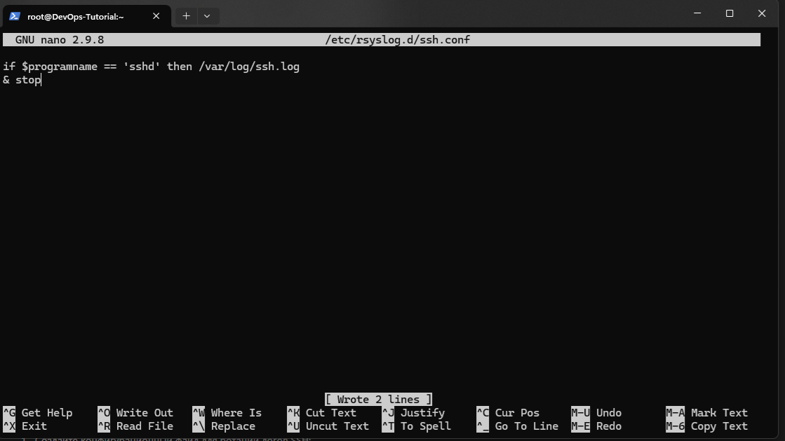
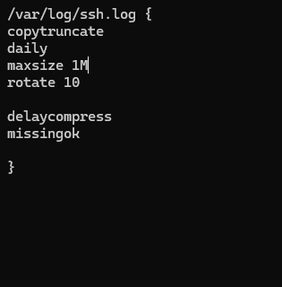
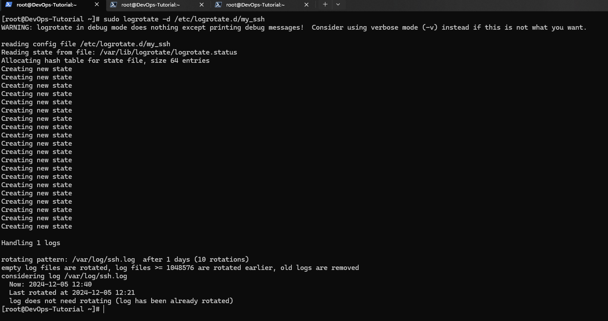

# Все события *ssh* записывать параллельно в отдельный файл, производить ротацию каждые сутки или по размеру (не более 1 мегабайта), всего 10 файлов в ротации

Перенаправим все сообщения от SSH (sshd) в отдельный файл:



Перезуграежм *rsyslog*:

```bash
[root@DevOps-Tutorial ~]# sudo systemctl restart rsyslog
```

Используя редактор **nano** создаем файл:

```bash
[root@DevOps-Tutorial ~]# nano etc/logrotate.d/my_ssh
```



Дерективы:
**daily** - означает ротация логов ежедневно
**size 1M** - размер файл в 1 Мегайбайт
**compress** - сжатия старых логов
**delaycompress** - предотвращает сжатие свежесозданного файла до следующего цикла ротации.
**missingok** - Если файл журнала отсутствует, перейдет к следующему без выдачи сообщения об ошибке.
**notifempty** - пустой файл
**create 0640 root root** - создает права, права уровня *root*

Проверка на *size 1M*, на данный момент файлы отсуствуют, поскольку в логи ничего не записывалось.
Файлы подлежат ротации, как только его размер превысит 1 MB (1048576 байт) или пройдет день.

